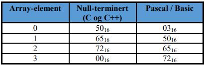

- maskering

-

    - sette eller lese enkeltbits i et bitmønster uten å påvirke de andre bitene i bitmønsteret
- tegn

-

    - ascii

    -

        - 7 bit
        - amerikanske tegn + kontrollsignaler
        - extended ascii

        -

            - ibm
            - 8 bit
            - standard i DOS
        - 33 første reservert til kontrolltegn
    - unicode

    -

        - ibm, microsoft...
        - internasjonal standard
        - 16 bit
        - hebraisk, japansk, norsk
        - java
    - strenger

    -

        - 
        - to metoder:
        - første element antall chars
        - siste element termineres med 0
- heltall

-

    - heltall uten fortegn (unsigned)
    - heltall med fortegn

    -

        - fortegnsbit

        -

            - 0 gir +
            - 1 gir -
            - ulempe: 2 representasjoner for 0
        - bias (forskyvning)

        -
            -

        - toerkompleks

        -

- toerkomplement

-

    - positive verdier er like representativt
    - negative: 11111 = -1, teller oppover til tomt for bits
    - første tallet 1 gir -, + gir +

    -