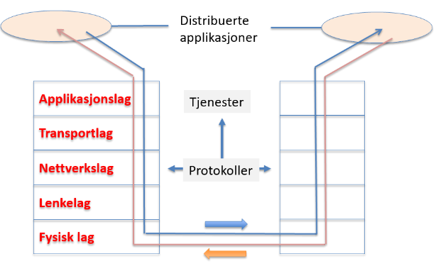
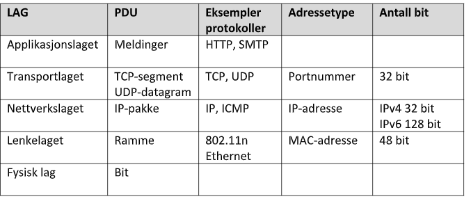

**Om lagmodellen**

- sammendrag
    - deler opp kompleks oppgave i separerte "lag"
    - utviklet av ISO, kalles OSI-modellen (Open Sysems Interconnection)
    - finnes flere utgaver, bruker forenklet 5-lags OSI-modellen:
        - applikasjonslag, transportlag, nettverkslag, lenkelag, fysisk lag
    - et lag benytter tjenester fra laget under, tjener laget  over, kommuniserer horisontalt over protokoller
    - 
- Hovedprinsipper
    - distribuerte applikasjoner har grensesnitt mot kommunikasjonsstakken
    - systemutviklere må utvikle iht. grensesnitt mot protokoller i applikasjonslaget
        - protokollene er definert av standardiseringsorganisasjoner
        - kan f.eks. bytte mellom trådløs og kablet dataoverføring uten å berøre nettverkslaget
- Oppgave for lagene
    - applikasjonslaget: grensesnitt mot distribuerte applikasjoner
    - transportlaget: ende-ende-overføring av meldinger
    - nettverkslaget: sørger for at hver pakke rutes gjennom nettet
    - lenkelaget: sørger for at pakkene overføres mellom to tilstøtende noder (mellom to nettverkskort)
    - fysisk lag: sender signaler over et transmisjonsmedium (luft, kopper, fiber)
- pakkeenheter (PDU) og adressering
    - PDU: enkelt enhet med informasjon som sendes mellom likestilte enheter i et datanettverk
        - protokoll-spesifikk info (pakkehodet) og brukerdata (nyttelast fra laget over)
        - 

**Innkapslingsprinsippet**
**
**
**
**

- Sammendrag
    - hvert lag legger/fjerner pakkeheader hos avsender/mottaker
- Beskrivelse
    - hver header har forskjellig info avh. av laget (eks.: laget over, flagg satt..), men alle inneholder avs-/mottakeradresse
- eksempel wireshark
    - meldinger kryptert med TLS (Transport Layer Security)

**Lagdelt Kryptering**
**
**

- Sammendrag
    - innholder (nyttelasten, pakken) på hver lag kan krypteres uavhengig av hva som skjer på andre lag
    - tre sikkerhetsmekanismer brukes: WPA2, TLS, VPN
        - fungerer på forskjellige lag og er uavhengige av hverandre
- Beskrivelse
    - må unngå korrupt data og feil mottaker
    - hvert lag krypteres, som gjør at hackere må dekryptere flere lag
- TLS
    - etterfølger av SSL
    - protokoller som gir sikker kommunikasjon i nettverk av maskiner
    - brukes i applikasjonslaget
    - brukes for å kryptere http-forespørsler og -respons uten å rote med TCP, kan også brukes i eks. email
    - https i nettleser indikerer TLS/SSL
- VPN (Virtual Private Network)
    - brukes hovedsaklig i nettverkslaget (etter TLS-kryptering)
    - vpn-brukere må autentisere seg, og kommuniserer med kryptert nøkkel
- WPA2 (Wifi Protected Access 2)
    - brukes i lenkelaget (etter TLS og VPN)
    - WEP -> WPA -> WPA2 -> WPA3

**IP-nett**
**
**

- Sammendrag
    - samling av maskiner med felles nettadresse og dermed lik nettmaske
    - maskiner på samme nett kan sende pakker til hverandre uten ruter
    - pakker til annet IP-nett går gjennom ruter med (unik) IP-adresse
    - IP-adresse består av 2 deler -nett-id, host-id
        - leses fra ip med logisk OG-operasjon på nettmaske og ip
    - adresse kan deles i flere nett (subnett) med fordeler:
        - reduserer broadcast-trafikk fra mange enheter, økt sikkerhet
- IP-nett
    - nettverkslaget: sørger for at hver pakke rutes gjennom nettet
    - ruter: videresender datapakker mellom ulike IP-nett gjennom de ulike datanettverkene sden er koblet opp med
- hvordan fungerer IP-nettet
    - ruter kobler sammen flere IP-nett
- IP-adresse
    - unik identifikator/adresse som tildeles enhet
    - IPv4 er 32 bit, IPv6 er 128 bit
- Nettmaske
    - nettmasken forteller hvor skillet i IP-en går mellom nettadresse og nodeadresse
    - nettmasken "maskerer" nodeadresen med OG for å sjekke om mottaker-IP tilhører samme IP-nett
- Subnetting
    - å dele inn nettverk i mindre nett
        - øker routing-effektivitet ved å kun sende info til de som trenger
        - øker sikkerhet ved isolering
- utregning av nettadresse
- 3. intervall fra IP OG med 3. intervall i nettmaske gir nettadresse

**Pakkesvitsjing**
**
**

- sammendrag
    - metode for å koble sender og mottaker
    - dataen deles opp i pakker med hver sin hale, hode, adresse og sendes gjennom svitsjer
    - alle pakker har sjekksum i pakkeheader for å hindre pakketap
- generelt
    - flere brukere deler på overføringskapasiteten i det samme nettverket (data begrenset av ruter eller fysiske linjer)
    - gir fordeling av overføringskapasitet og rutingen blir tatt hånd om
    - krever komplisert infrastruktur og protokoller, kan oppstå pakketap, men er minimalt problem i dag
- adressering gjennom datagramnettverk
    - bruker mottakeradressen kontinuerlig med IP og neste node (svitsj/ruter)
    - ved for mye trafikk, vil pakkene mellomlagres i kø på noden
        - ved for lite plass på noden, vil pakken forkastes
    - maskinene på internett ser kun IP-adressen
    - på lokalnettverket sorterer ruteren pakker til riktig maskin
- sjekksum
    - Verdi i pakkeheader som sjekker for korrupt/tapt data
    - genereres basert på dataen med hashing
    - mottaker hasher dataen og sjekker for match
    - sjekksum-kalkulering fungerer stort sett
    - mottaker må evt. forespørre ny pakke
- linjesvitsjing som alternativ
    - gammelt alternativ som ble brukt i telefonsentraler
    - forbindelse blir koblet opp på forhånd med reservert kapasitet direkte mellom avsender og mottaker
    - lav forsinkelse, rask overføring, opprette forbindelse tar tid, dårlig utnyttelse av kapasitet (lite fleksibelt)

**IETF**

- Sammendrag
    - standarder for applikasjon, transport, internett, lenkelaget
    - hovedfokus er TCP/IP-standarder
    - arbeidsform er Request for Comments (RFC) eks: IPv4 har RFC 791
- oppgaver
    - utvikle, promotere, vedlikeholde internett-standarder
    - fokus på kommunikasjonsprotokoller som TCP/IP
    - sørge for at teknologi:
        - kan utføre nødvendig funksjon
        - distribueres riktig og er skalerbar
        - er sikkert og kan opereres på en sikker måte
        - er overkommelig å bruke
- arbeidsmetoder
    - frivillig organisasjon
    - møter 3 ganger årlig
    - avgjørelser på grov konsensus
- til slutt
    - standardisering gir sammarbeid og hindrer monopol

**IEEE (Institute of Electrical and Electronics Engineers)**
**
**

- Sammendrag
    - non-profitt organisasjon med mål om å fremme ingeniøraktivitetene i forbindelse med teknologiutvikling
    - har også studenttilbud som forskningsartikler og nett-tv
    - 430k medlemmer med utdanning innen ingeniør/teknologi, 100k er studenter
    - har standarder som f.eks. flyttall, wifi osv.
    - har mye ressurser for research og hjelper studenter
    - fremtidsmål:
        - fremme global innovasjon gjenom sammarbeid og kunnskapsdeling
        - forbedre offentlig forståelse av fagfeltet, samt skape standarder for dette
        - pålitelig kilde til utdannning og læring
        - by på karriæremuligheter
        - informere om teknologi til offentligheten