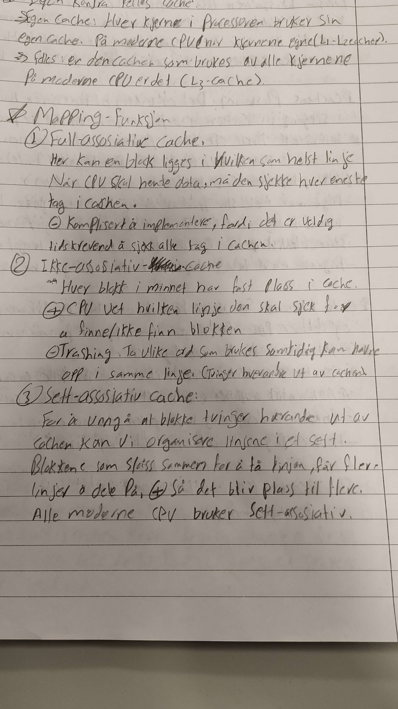

Mapping:

full-assosiativ: blokk kan legges i tilfeldig linje, må sjekke hver linje samtidig

ikke-assosiativ: hver blokk har fast delt linje i cache, men trashing kan oppstå

sett-assosiativ: linjer slås sammen til sett med n antall linjer, og  blokker har faste sett

utskiftingsalgoritmer (ved trashing)
least recently used
first in first out
least frequently used
random (enkleste er ofte d beste(pga lav forsinkelse))

skriving til minnet

write through: skriver til cache og minne, minnet er alltid oppdatert, men tar lenger tid å skrive

write back: skriver til cache, minnet oppdateres kun ved trashing. tar lenger tid når den først oppdaterer

cache-koherens: samsvar mellom cache og minne

DMA kan gi problemer med cache, derfor finnes cache-kontrollere som synkroniserer private cacher, cache-flush osv

enhetlig cache: tilpasser forhold mellom instruksjoner og data

splittet cache: en cache til hver (data og instruksjoner), fordel om man trenger begge samtidig ved multi-cpu-tilfeller

sett-størrelse: mindre gir mer trashing, større er mer komplekst og større straff ved bom. altså bomstraff vs treffgevinst. lav for L1 pga. lav bomstraff, stor for L3