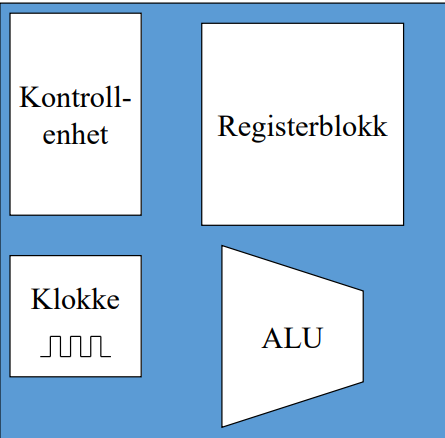
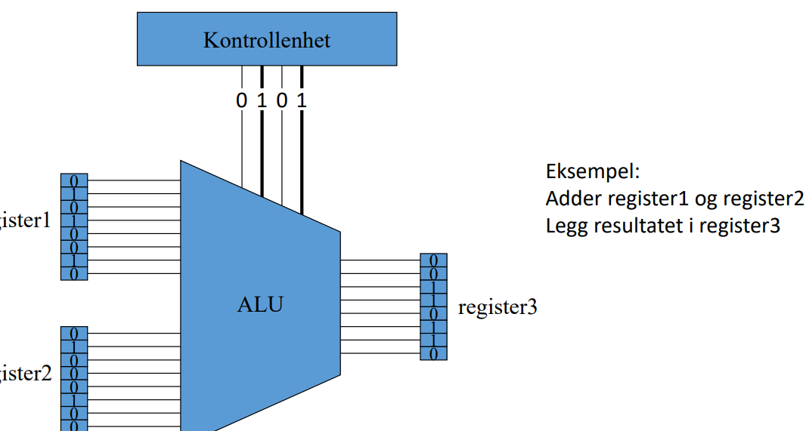

- cpu-kjerne
- 
    - registerblokk
        - samling register
            - acu
            - pc
            - ir
    - alu
    - kontrollenhet
        - styrer hva som skal skje pr klokkeslag
        - styrer med kontrollsignal
        - utfører mikro-op-er
    - klokke
        - 1 slag pr mikro-operasjon
    - 2 data in, 1 ut
- registerblokk
    - samling av alle registre i kjernen
    - synlige
        - generelle (kan legge data i)
    - kontroll-/statusreg
        - aksess via priviligerte instruksjoner
        - flagg (cpu-status)
            - resultat av forrige instruksjon
                - overflow
    - interne
        - buffer
- registervindu i debugging
- mikro-operasjoner (1 klokkepuls)
    - flytte data mellom registre
        - kontrollenhet setter på styresignaler på cpu-bussen mellom to registre på output og input til hvert register
    - utføre alu-operasjoner
        - kontrollenhet signaliserer op-kode
        - 
    - flytte data mellom register og minne

3 typer mikro-ops

flytte data internt

kontrollenheten sender styresignal til intern spu-buss om å åpne ut-signal på reg1 og inn-signal på reg2. dette gjør at reg1 kan overføre et "ord" over bussen

flytte data eksternt

kontrollenheten åpner system-bussen for overføring til f.eks. IO-utstyr eller minne. dette gjør at data kan overføres inn eller ut fra cpu 1 ord av gangen. dataen vil ikke gå direkte til io-utstyr, men til en kontroller som tolkes av cpu som en vanlig minneadresse. derfor kan data overføres mellom både cpu-io og cpu-minne

utføre beregninger med alu

input: 2 registre som mulige operander, styresignaler fra kontrollenhet med op-kode

output: register
eks: add reg1 reg2, svaret legges i reg1