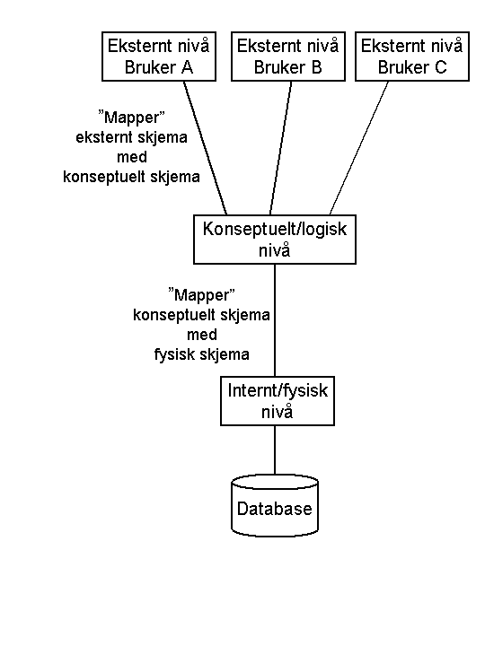
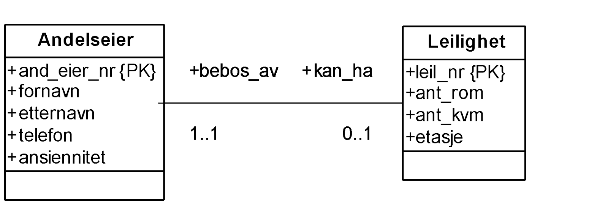
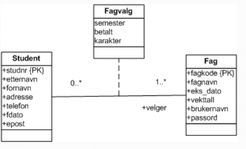
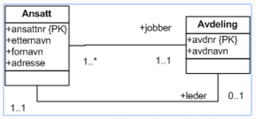
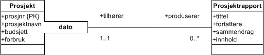

skjema = databasebeskrivelse

- eksternt skjema (subskjema)

-

    - applikasjonens vindu(-er) mot databasen
    - brukerne er sluttbrukere
- konseptuelt skjema

-

    - modell av hele databasen

(ER/EER- og relasjonsmodellen)

-

    - brukerne er DBA
    - dataene som tabeller
- internt nivå

-

    - indekser, fysisk rekkefølge av poster, etc
- fysisk nivå

-

    - oppdelingen av disken i sider, blokker osv.
- logisk datauavhengighet

-

    - eksterne skjema uavhengig av endringer i det konseptuelle skjema
- fysisk datauavhengighet

-

    - lagringsstrukturer må kunne endres uten at det berører det konseptuelle skjema

Én andelseier “kan ha” minimum 0, maksimum 1 leilighet (rød).
Én leilighet “bebos av” minimum 1, maksimum 1 andelseier (grønn).
andelseier(*and_eier_nr*, fornavn, etternavn, telefon, ansiennitet)
leilighet(*leil_nr*, ant_rom, ant_kvm, etasje, and_eier_nr*)

- 0..1 – delvis avhengighet

1..1 – total avhengighet    ----- NOT NULL UNIQUE

****I en én-til-mange-sammenhengstype kommer fremmednøkkelen på mange-siden i ****

**
**
** **
** **  ** **
**Fremmednøkler vises ikke i ER-diagrammene.
Det er unødvendig fordi man ser sammenhengene
ut fra multiplisitetene.

Du tegner ikke “koplingstabellen” i ER-diagrammet
hvis den ikke har egne attributter (nederste figur)**

** **
to sammenhengstyper

entitet = objekt
entitetstype = klasse uten metoder

****Sterke og svake entitetstyper****
**
**
**En  *sterk entitetstype*  eksisterer
uavhengig av andre entitetstyper.**
**
**
**En  *svak entitetstype*  er avhengig av
en annen entitetstype for å
kunne identifiseres.  ***Identitetsavhengighet*****.****
**
**
**Et prosjekt produserer min 0, maks mange rapporter.**
**En rapport identifiseres ved prosjektnr og dato. Maks en rapport pr dato.**
**prosjekt(prosjnr, prosjektnavn, budsjett, forbruk)
prosjektrapport(prosjnr*, dato, tittel, forfattere, sammendrag, innhold)**
**

**
**side  13**
**
**

****Oppsummering****
**
**

- **Databasearkitektur**

-

    - **Logisk og fysisk datauavhengighet**
- **Elementer i et ER-diagram**

-

    - **Attributter**
    - **Entitetstyper, svake/sterke**

    -

        - **En entitet er en forekomst av en entitetstype**
    - **Sammenhengstyper –**

    -

        - **En forekomst av en sammenhengstype viser sammenhengen mellom to entiteter (entitetstypeforekomster)**
        - **Multiplisitet, en-til-en, en-til-mange, mange-til-mange**
        - **binær, trinær – antall involverte entiteter i en sammenheng**
        - **rekursiv (nettverk, trestruktur) – sammenheng mellom entiteter av samme type**