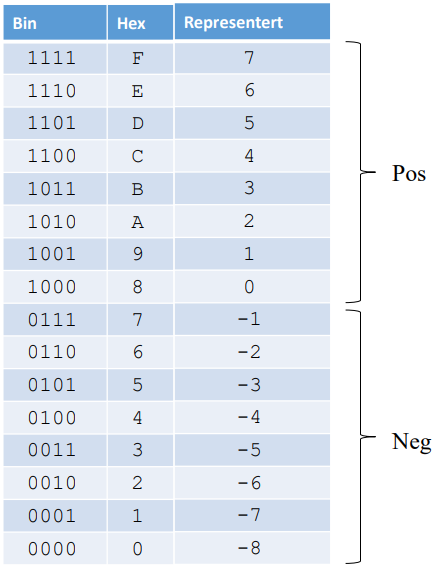
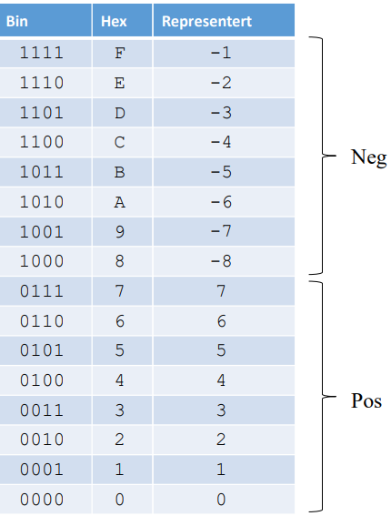

- bitmønster
    - instruksjoner er delt i opkode og operand
    - heltall er delt i fortegn og verdi
    - ascii-tegn er delt et tegn pr byte
- datatyper
    - logiske (and, or, xor, not..)
        - shift/rotasjon
        - representasjon
        - maskering
    - tegn og strenger
        - ascii og unicode
        - lengde
        - operasjoner
    - heltall
    - flyttall
- heltall
    - heltall uten fortegn
        - bruker bit-verdien direkte (maks representasjon = 2^bits-1)
    - heltall med fortegn
        - halvparten til positive og negative
        - flere formateringsvalg
            - fortegnsbit
                - 0 -> +, 1 -> -
                - - to verdier for 0
                - matten stemmer ikke 0 til 7, -0 til -7
                - 
            - forskyvning (bias)
                - 
                - forskyver verdiene en halv skala
                - - rar verdi for 0
                - ingen verdi stemmer med bitmønster
            - toer-komplement
                - vanskeligste metoden
                - virker tungvint
                - 
                - positive tall har egen verdi
                - -1 representert med kun 1-ere
                - minste negative tall starter med 1 og resten 0
                - msb (fortegnsbit) = 0 for +, 1 for -
                - finne negative tallverdier:
                    - komplementere og addere 1 (enkelt for cpu)
                        - 0 blir 1, 1 blir 0
                        - legg til 1
                        - virker begge veier
                    - hurtigtriks
                        - start bakfra og behold alle bits uendret tom. første ener
                        - komplementer resten av bitsene
                - addisjon og subtraksjon
            - overflow
                - resultat kan bli større enn største mulige absoluttverdi -> overflow
- tegn og strenger
    - ascii
        - american standard code for information interchange
        - opprinnelig 7-bits-kode
        - utvidet ascii er 8-bits
    - unicode
        - 16-bits
        - tar mer plass
        - kan representere 65536 tegn (hebraiske, japanske, norske)
        - unicode brukes i java
    - streng-lengde
        - varierer i lengde
        - java: 16-bits unicode, lengden lagres som 32-bits heltall med fortegn
        - c/c++: ascii, avsluttes med ascii-verdien 00
        - pascal/basic: ascii, første element har lengden (maks 255)