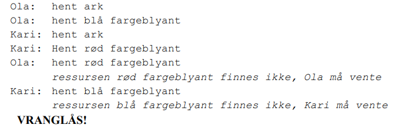
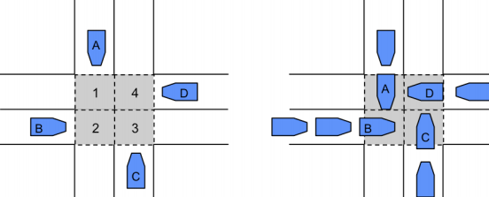
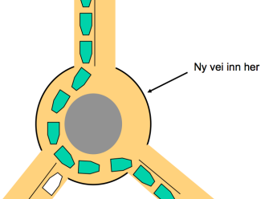

- innledning

-

    - permanent blokkering av flere prosesser som konkurrerer om de samme ressursene.
    - konsekvens av å kjøre mange prosesser samtidig med begrenset antall ressurser i maskinen
    - oppstår sjeldent, men uforutsigbart fordi kjøringer varierer fra gang til gang

    -

        - eks: hvor langt de har kommet i kjøringen ift. hverandre, rekkefølge de allokerrer ressurser..
    - for krevende å sjekke på forhånd hver gang
- eksempler på vranglås

-

    - knyttet til ressursallokering
    - os-et fordeler ressurser til prossessene
    - program må vente til det blir scheduled
    - to prossesser kan gjøre krav på samme ressurser
    - eks tegne flagg:

    -

        - 
        - begge venter på en ressurs den andre har (fordi prossessene er forkjellig rekkefølge)
    - eks prosess-tabell:
    - prosess-tabell har begrenset plass. hver prosess må forke for å fortsette, men ingen får forket nok til å fortsette. vranglås!

    -

        - løsning: la en og en forke istedenfor alle på en gang slik at de får fullført og frigjort plass til resten
    - eks veikryss
    - 
    - løsning: bestille kvadranter først
    - løsning: 
    - starvation av den hvite fordi den ikke får ressurser, men ikke vranglås fordi den får etterhvert.
- Hva er vrangsås?

-

    - oppstår når prosesser blokkeres fordi de venter på den andres ressurs(er) (syklisk venting)
    - vranglåser har oppstått fordi:

    -

        - uforutsigbart hvilke ressurser som trengs
        - en prosess kan ikke lenger okkupere en ressurs hele livet, kun tidsbegrenset (dynamisk ressursdeling)
    - betingelser (alle må være oppfylt for vranglås)

    -

        - gjensidig utelukkelse: ressurs er ledig eller allokert til prosess. andre får ikke tilgang. mange er av denne typen
        - hold på ressurs og vent: prosess kan holde på ressurs samtidig som den spør etter nye
        - no pre-emption: ressurser kan bare frigis av prosessen selv. kun prosessen selv som kan frigi ressursen
        - sirkulær venting: som i veikrysset
- metoder for håndtering av vranglås

-

    - 1. hindre vranglås: bruker de 4 betingelsene og sørger for at minst 1 ikke opprylles. krevende og ueffektivt

    -

        - hindre gjensidig utelukkelse: går ikke
        - hold på ressurs og vent: kan lett føre til vranglås. en prosess allokerer før den starter. dersom ikke alle er tilgjengelig, må den vente. løsning: allokerer alt på en gang.
        - no pre-emption: må gjøre at ressurser kan frigjøres fra prosesser. prosessen gir fra seg alle ressurser frivillig, eventuelt reallokere senere.
        - sirkulær venting: ressursene må allokeres i gitt rekkefølge. eks. høyreregel i veikryss.
    - 2. unngå vranglås: ressurs-admin ungår å si ja til risky ressursforespørsel (ressurskrevende å sjekke)

    -

        - ressurs-admin må vite om prossesens framtidig ressursbehov
        - eks. bank: flere lånetakere fører til konkurs og hver lånetaker trenger mer ressurser for å tjene tilbake
        - løsning:

        -

            - sikker: sjekker maks ressursbehov pr prosess
            - usikker: satse på at prossessene ikke bruker maks ressurser
            - vranglås: ressurs-admin aksepterer forespørsler i en gitt rekkefølge (må unngås)
    - 3. oppdage vranglås: ressursforespørsler aksepteres hvis ledige. os-et sjekker jevnlig for vranglåser og løser eks. ved å frata ressurser

    -

        - ser etter sykluser av ressurser og prosesser mellom hverandre
        - bruker deskriptorer til å se hva som peker på hva
        - løsning:

        -

            - fjerne ressurser fra prosess, deretter gi tilbake.
            - rollback: restarte prosesser som ofte låser seg med sjekkpunkt