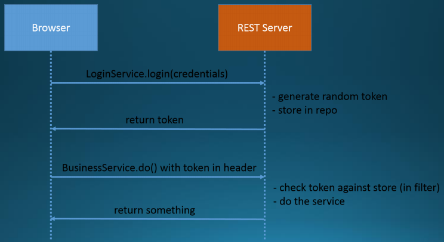
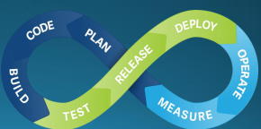
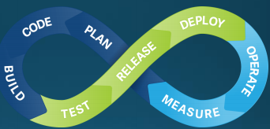

MMI RECAP

- wcag 2 RECAP
    - tekst over bilder
    - høy kontrast
    - kan zoome uten tap
    - hoppe ned på siden
    - sidetitler
    - tittel i lenker
    - synlig fokus ved tabbing
    - elementer med samme funksjon på tvers av sider har samme utforming (eks. hovedside-knapp)
    - ordentlige feilmeldinger
    - ledetekst ved input

OWASP top 3

    - a1: injection flaws such as sql. occurs when untrusted data is sent to an interpreter and is used as a part of a query, allowing the data to manipulate the query to do unauthorized things.
    - a2: broken authentication: client functions implemented incorrectly can lead to exploitation compromising passwords, keys, or tokens, allowing for unauthenticated access to other user accounts temporarily or permanently
    - a3: sensitive data exposure: sensitive data that is not properly protected can be used by hackers. precautions are data encryption both at rest and in transit, as well as salting.

klient/server

- protokollen er http
    - innholdet er:
        - html, xml, json, txt, jpg, pdf...
- get/post
    - request fra klient til server er ofte get/post
    - kan lage post-req med ajax-kall
- web-request/respons
    - header: mime-type, name
    - body: html/jpg...
- http-statuskoder
    - 100: klientfeil
    - 200: ok
    - 300: redirigering, litt spesiell
    - 400: bad request (syntaks-feil)
    - 401: unauthorized
    - 403: forbidden (ligner på 401, men må ha med begrunnelse)
    - 404: not found (forespurt data ble ikke funnet)
    - 500: internal server error
    - 503: server nede for vedlikehold eller overbelastning
- mime-type: i headeren står det hva slags type bodyen er av

REST

- rest
    - representational state transfer
    - ressursorientert arkitektur for distribuerte systemer bestående av ressurser og enkle, definerte operasjoner man kan utføre på disse
    - klient-tjener-arkitektur
    - restfull bruk av rest-arkitekturen gir oversiktlig design
    - moderne
- ressurser
    - representeres med URI/URL
    - type html-dok, bilder, json, pdf...
    - aksesseres med endepunkt
- http-verb
    - alle untatt post skal være "idempotente" dvs. gi samme resultat ved flere av samme kall
    - skal representeres hierarkisk
- json
    - javascript object notation

NODEJS/NPM

- hvorfor bruke rammeverk?
    - raskere resultat pga ferdig kode
    - følger standarder
    - tvinger strukturering
    - bedre ytelse
- hvorfor ikke bruke rammeverk?
    - for intrusift, lite praktisk
    - kan sette begrensninger
    - kan sette sterke føringer
    - fort utdatert
    - stock funker
- server-rammeverk
    - nodeJS (app) for http-verb-kall
- klient-rammeverk
    - reaCT
        - gjenbrukbare komponenter
        - virtuelt dom-tre, rendres på nytt ved tistandsendringer - raskere
- universal rendering
    - bruker server-skripting til å returnere ferdig renderet html
- npm
    - node package manager
    - dependency management
    - package.json
        - gir pakken (prosjektet) navn
        - lister opp alle avhengigheter
        - brukes til å installere avhengigheter ved prosjekt-installering
        - avhengigheter installeres i node_modules (insert i .gitignore)
- Ecmascript...ES8 -> TypeScript
    - standardisering av JS
    - TS kompilerer til JS, som støttes av alle nettlesere

TILSTAND

- tilstand
    - web-app må lagre tilstand, tre måter:
        - klienttilstand i klassiske web-apps: cookies (infokapsler)/omskriving av url
        - klienttilstand i moderne web-apps: variabler i js og localstorage
        - tilstand på server: varer til nettleser lukkes (session)
        - persistent tilstand: tilstand som ønskes å lagre over tid, bruker db til å lagre
    - klient: cookies, localStorage, sessionStorage, js-variabler
    - server: web-sesjoner
    - db: persistent lagring
- web-sesjoner
    - tilstand for EN klient, lagres på appen, lagres på server/db
    - bruker normalt bare db hvis serveren kjører på flere maskiner pga. fordelt minne
    - for at klienten aksesserer riktig web-sesjon, lagres sesjons-id i cookie i nettleser for at serveren finner riktig sesjon og tilstand for riktig klient
- web sesjon: livssyklus
    - opprettes ved pålogging, kastes ved avlogging
    - sesjon har timeout eks. 30m, dvs. sesjonen kastes ved inaktivitet
    - ved logout kjøres session.invalidate() for å frigjøre minne på server og slette sensitiv data i tilstanden
- cookies (infokapsler)
    - klientside lagrer små datamengder for å:
        - huske brukervalg
        - lagre sesjons-id for web-sesjoner
    - forsvinner når nettleser lukkes, lagres ikke på disk
    - de med levetid kan huske info fra sesjon til sesjon som lagres i disk i txt
        - erstattet av localStorage
- localStorage/sessionStorage
    - js-objekter for å lagre tilstand på klient
    - kan lagre mer enn i cookie
    - begge er en map
    - sessionStorage slettes når nettleser lukkes
    - localStorage slettes ikke når nettleser lukkes
- REST og tilstand
    - for at REST-tjeneste skal være restful, bør den ikke inneholde noe tilstand
    - mulig unntak er lagring av påloggingsinfo for å få enkel beskyttelse av rest-serveren

Autentisering

- Single Sign-On
    - logger på sentral påloggingstjeneste, får token tilbake
    - kan bruke samme token på flere tjenester uten relogin
- autentisering i REST-tjenester
    - sesjonsbasert
        - enkelt
        - bruker servertilstand
        - fungerer ikke over mange REST-tjenester (SSO)
    - Token-basert (usignerte tokens)
        - kan brukes på mange tjenester (SSO)
        - token må sendes i hvert kall (helst i Authorization-header)
        - krever et sentralt token-registry (db)
    - sertifikat-basert (signerte tokens)
        - beste løsning
        - vanskelig med signering og token i hvert kall
        - tilstandsløst => restfult
        - kan brukes på mange tjenester (SSO)
    - express middleware
        - usynlig/abstrakt som puttes mellom to lag (applikasjoner)
        - setter opp express controller med app.use for å begrense tilgang
    - sesjonsbasert autentisering
        - ingen token, alt skjer i server-endepunkt
    - tokenbasert (usignert
        - 
    - signaturbasert autentisering
        - samme greia, men JWT (JSON Web Token) med secret isteden
        - sjekker ikke mot db, validerer kun gyldig signatur
        - utsteder av token (loginService) må bruke privat sertifikat
        - konsumenter av token må bruke public sertifikat
    - JWT - struktur
        - ved oppretting av jwt, fylles det ut claims (name, value)-par (JSON)
        - signerer deretter med bibliotek, som genererer header og signatur
        - ender opp med kodet streng separert i 3 med punktum
    - JWT - login
        - post-endepunkt som tar inn brukernavn og passord
        - returnerer {"jwt": jfklds.fjkldsakøf.jfklajfl"}
    - Security Assertion Markup Language (SAML)
        - eldre enn og utkonkurrert JWT og OAuth2
        - samme prinsipp, bruker XML kontra liten JSON
    - OAuth2
        - åpen protokoll, kan derfor bruke påloggingsfunksjonalitet til flere id providers
        - bruker også signerte tokens som puttes i header
        - passport gjør det mulig pålogging til egne apper
        - enkelt for brukeren med færre pålogginger

Designmønstre

- def: løsning på hvordan strukturere et design
- antipattern
    - dårlig løsning på designproblem
    - singleton kan ses på som antipattern fordi det introduserer global tilstand
    - uenighet
- om designmønstre
    - kunnskap om designmønster gir muligheten til å referere til praksiser ved diskusjon
    - ofte bedre å bruke innebygd patterns
- eksempler på designmønstre
    - dao/repository
    - middleware/pipeline/mediator
    - service/facade
    - adapter/proxy
    - oveservable/listener
    - dependency injection/inversion control/IoC
    - singleton
    - polymorfisme/mocking
- kobling og kohesjon
    - gode designmønstre hjelper å lage løsninger med løse koblinger og høy kohesjon
- koblinger
    - kobler/kunnskap/avhenger av andre moduler
    - sterke koblinger er vanskelig å:
        - refaktorisere
        - gjenbruke
        - teste
        - lese
- polymorfisme
    - separering av interface og implementasjon
- dependency injection/inversion control (IoC)
    - istedenfor at objekter oppretter avhengigheter selv, får de servert dem av klienten
    - avhengigheter blir tydelighjort i grensesnittet => lettere å forstå koden
- DI-rammeverk
    - eks. spring og angular
- mocking
    - etterligner reele objekter ved å kopiere funksjonalitet
    - mock-rammeverk brukes for enkel mocking uten å trenge å lage egne klasser
        - kan gjøres direkte i testene
- adapter
    - objekt som konverterer et grensesnitt til et annet
    - eks dao til repo
- service/facade
    - definerer høynivå grensesnitt
    - eks service i reactjs

-

TDD

- intro
    - RED: write test, watch it fail
    - GREEN: write enough code to pass
    - REFACTOR
    - videreføring av XP
- test består av 4 faser:
    - oppretter utgangstilstand setUp()
    - utfør testoperasjoner test(): set()
    - validerer ny tilstand test(): get()
    - rydd opp tearDown()
- test-first
    - lager krav-spek i test på og progger fra det
    - parallell/tidlig testing gir umiddelbar respons
- TDD - motivasjon
    - slipper å dokumentere specs hvis definert i tester
    - trygghet for at koden funker
    - kombinerer akseptansekrav og test
- Testing generelt
    - tester for å validere at systemet:
        - responderer riktig på input
        - yter bra ved trykk og over tid
        - brukervenlig nok
        - møter kravene satt av interessenter
        - kan installeres i riktig miljø
        - ikke brekker ved endringer
    - med smidig metodikk tester man kontinuerlig og automatisk. ansvar ligger hos utviklere kontra testere.
- tradisjonell vs smidig testing
    - tidligere fram og tilbake mellom team
    - nå er det samspill: testere guider utviklere, mer feilfritt med en gang
    - user story blir testet med en gang den fullføres
    - testere er med på definition of done for user stories
    - umiddelbar leveranse til testmiljø ved ci
    - 
- å teste akkurat nok
    - vuredere passe risiko-nivå på testing
- testnivåer
    - system test: tregt, kostbart
        - fullt integrert system, ende-til-ende all inclusive, avhenger av eks db
    - integration test: mellomting
        - større komponenter satt sammen
    - unit test: raskt, billig
        - enkle ting hver for seg
- test-typer
    - akseptansetesting
        - kunden tester for å godkjenne
    - regresjonstesting
        - sikre at systemet ikke brekker ved endringer
    - smoke-testing
        - uformell testing der utviklere raskt tester ut ting
    - utforskende
        - testeren bruker kunnskap og erfaring med testing sammen med kunnskap om systemet til å finne hull
        - destruktiv utforskende
    - usability testing
        - tester hvorvidt systemet er lett å bruke ved å observere brukertester
    - ytelsestesting
        - normale responstider
        - responstid under press
        - maks stressnivå
        - finne flaskehalser med profileringsverktøy
        - automatisk
    - stabilitetstesting
        - ligner ytelsestest, men over tid
    - test-data
        - lik data
        - repeterbart
        - deterministisk
    - test-data - in memory db
        - lager ny db hver gang med script, dropper etter test
    - testdata - db på ci-server
        - bruke docker til å sette opp container platfor for testing
        - docker kan bygge test-miljø

CI

- 
- i praksis
    - bygge kode automatisk
    - periodisk eller ved hver innsjekk til git
    - etter bygging kjøres testene
    - genererer rapporter (eks. dekningsgrad)
    - kan varsle om feil
    - sikrer at innsjekket kode alltid er stabil
- Continuous Deployment
    - kan trigge automatisk utrulling ved innsjekk på master
    - vil ofte gjøre manuelle tester før utrulling, men med god automasjon, er det likevel mulig
- tradisjonell utrulling
    - stor og tung prosess å få nye versjoner i produksjon
        - mange manuelle trinn ved bygging, pakking, installasjon, miljøtesting
    - førte til sjelden deployment
    - lite smidig
- bygging - maven
    - prosjektstruktur-konvensjoner gir ryddig struktur
    - vanlig i java
    - pom.xml som prosjektfil for å dele universalt
- dependency management
    - eks. maven, npm
- byggeserver
    - dedikert server med byggescript for å bygge, teste, integrere komponenter (eks TravisCI)
- gitlab ci/docker
    - gir samme produksjonsmiljø hver gang, simulerer brukerinstallasjon
    - konfigureres med .yml i root

Universell utforming

- definisjon
    - lage ting slike at de er tilgjengelig for alle - med eller uten funksjonshemninger
- lovkrav og tilsyn
    - difi krever at 35/61 suksesskriterier i wcag 2 oppfylles
- prinsipper for universell utforming
    - enkel og intuitiv i bruk
        - lett å forstå uten erfaring
    - fleksibel i bruk
        - alle skal kunne bruke systemet til tross for handicap
    - toleranse for feil
        - minimalisere skader som kan gi negative konsekvenser
    - lav fysisk anstrengelse
        - skal kunne brukes komfortabelt
    - forståelig informasjon
        - kommunisere nødvendig info effektivt
    - like muligheter for alle brukere
        - tilgjengelig for personer med ulike ferdigheter
    - størrelse og plass for bruk og tilgang
        - eks. rullestolbrukere som ikke når fram til ting

Brukskvalitet for nettsider

- layout
    - innholdet skal stå i fokus
- nettstedstruktur og navigasjon
    - oppbygning avgjør hvor lett det er å finne fram
        - startsiden bør være informativ, attraktivt startpunkt, nyttig
    - hvor er jeg?

Interasjonsdesign

- Menneske-Maskin-Interaksjon (MMI)
    - forbedre samhandling mellom mennesker og datateknologi
    - UI er viktig for at systemet skal gjøre det vi vil
- interaksjonsdesign: designe samhandling mellom mennesker og digitale systemer
    - Definere krav
        - hvem er brukerne, hva ønsker de for produktet?
    - designe alternativer
        - konseptuell modell som utgangspunkt
    - lage prototyper
        - for å virkelig forstå designene
    - evaluering
        - undersøker brukskvaliteten basert på kravene