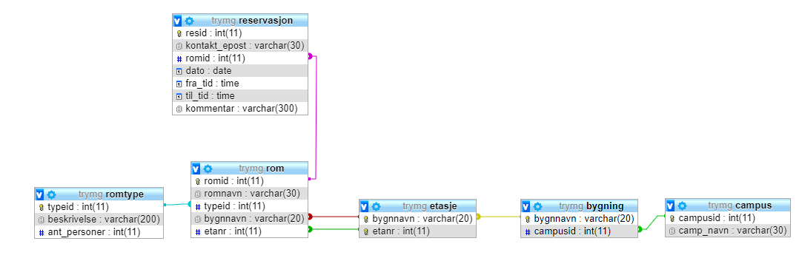

[https://docs.google.com/presentation/d/1-n3MY-6b0Wx51476T-WmnhND1HUgxcaEXLEqsiYe7YE/edit#slide=id.p7](https://docs.google.com/presentation/d/1-n3MY-6b0Wx51476T-WmnhND1HUgxcaEXLEqsiYe7YE/edit%23slide%3Did.p7)

- kan ikke ha direkte relasjon ved flere enn 1 relasjon, må lage egen entitet imellom
- ved 1-1 trengs ikke egen tabell, kan inkludere atributten inn i tabellen
- spesialisering: tar felles attributter inn i superklasse
- relasjonsalgebra
    - unionkompatible tabeller: må ha samme kolonne å joine på
    - natural join kan kun brukes ved kun 1 felles attributt, bruk join isteden
    - inner join = join
    - group by deler opp i
    - outer join tar med alle rader som ikke er med i begge tabeller. gir null i noen celler
    - group by eier_id gir en gruppe for hver eier_id der hver rad har samme eier_id
- normalisering
    - f.a.: x determinerer y: for hver x, kun 1 y
        - eks: studnr gir 1 navn, et navn gir flere nr
            - studnr determinerer navn, ikke motsatt
    - supernøkler
    - kandidatnøkler mapper til noe
    - nøkkelattributt: attributt som er med i kandidatnøkkel, men mapper ikke til noe alene
    - normalisering deler opp i egne tabeller for hvert objekt
    - 1nf
        - atomiske verdier, ikke liste inni celle
    - 2nf
        - hele nøkkelen (ikke deler) determinerer ikke-nøkkel-attributtene
    - 3nf
        - alle avhengigheter x -> a: enten er x en supernøkkel eller a er en nøkkelattributt i tabellen
    - bcnf
        - F: bevare funksjonelle avhengiheter
        - A: bevare alle attributter
        - N: alle normalformer
        - T: tapsløs join
- select from where group by having union order by

-

aggregering må bruke objekt.get()-verdier
komposisjon bruker objektet direkte

- - [X] nøkler
- - [ ] serialiserbare og gjenopprettbare transaksjoner
- - [ ] låser
- - [ ] trans
- - [ ] interface
- - [ ] norm
- - [ ] gui
- - [ ] sql
    - - [ ] lage tabeller
- - [ ] javakode
- - [ ] select-setninger
- - [ ] arraylist søking osv.
- - [ ] arv
- - [ ] polymorfi
- - [ ] prepare
- - [ ] result
- - [ ] insert
- - [ ] equals
- - [ ] compareto
- - [ ] javafx

- SQL:
- count(*) teller rader
- GROUP BY and HAVING
- Group By X means **put all those with the same value for X in the one group**.
- Group By X, Y means **put all those with the same values for both X and Y in the one group**.
- By including a GROUP BY clause functions such as SUM and COUNT are applied to groups of items sharing values. When you specify GROUP BY continent the result is that you get only one row for each different value of continent. All the other columns must be "aggregated" by one of SUM, COUNT ...
- The HAVING clause allows use to filter the groups which are displayed. The WHERE clause filters rows before the aggregation, the HAVING clause filters after the aggregation.
- If a ORDER BY clause is included we can refer to columns by their position.
- WHERE clause introduces a condition on *individual rows*; HAVING clause introduces a condition on *aggregations*, i.e. results of selection where a single result, such as count, average, min, max, or sum, has been produced from *multiple* rows. Your query calls for a second kind of condition (i.e. a condition on an aggregation) hence HAVING works correctly.
- As a rule of thumb, use WHERE before GROUP BY and HAVING after GROUP BY. It is a rather primitive rule, but it is useful in more than 90% of the cases.
- in
- dato between (yyyy-dd-mm) and (yyyy-dd-mm)
- **Abstraction** is a process of hiding the implementation details and showing only functionality to the user.
    - klasse med abstrakt metode(r) må være abstrakt
    - It needs to be extended and its method implemented.
    - An abstract class must be declared with an abstract keyword.
    - It can have abstract and non-abstract methods.
    - It cannot be instantiated.
    - It can have constructors and static methods also.
    - It can have final methods which will force the subclass not to change the body of the method.
- interface
- ikke mulig å inherite fra flere klasser samtidig
- interface is an empty class that tells someone
- ______________________________________________________________
- | │ Class │ Package │ Subclass │ Subclass │ World |
- | │ │ │(same pkg)│(diff pkg)│ |
- |───────────┼───────┼─────────┼──────────┼──────────┼────────|
- |public │ + │ + │ + │ + │ + |
- |───────────┼───────┼─────────┼──────────┼──────────┼────────|
- |protected │ + │ + │ + │ + │ |
- |───────────┼───────┼─────────┼──────────┼──────────┼────────|
- |no modifier│ + │ + │ + │ │ |
- |───────────┼───────┼─────────┼──────────┼──────────┼────────|
- |private │ + │ │ │ │ |
- |___________|_______|_________|__________|__________|________|

- komposisjon - lage nytt objekt
    - har-en
    - eks: legge til i arraylist
        - lager helt nytt objekt (kopi) med samme attributter
- aggregering
    - er-en
    - bruker originalt objekt
- diamant plasseres inntil moderklassen
- arv og polymorfi
    - arver attributter og metoder
        - private arves ikke
        - protected/public/package arves
- klasse implements comparable for å kunne f.eks. sortere klassen eller bruke compareTo() generelt
    - @Override

 public  int  compareTo(Object o)  {
 return  this.getId()  - o.getId();
 }

- **public class **Rovdyrfabrikk {

**public **SkandinaviskeRovdyr nyBinne(String navn, **int **ankommetDato, **int **fDato, String adresse){

 **return new **Hunnindivid(**"Brunbjørn"**,**"Ursus arctos"**,**"Ursidae"**,ankommetDato,navn,fDato,**true**,adresse,0);

}

 **public **SkandinaviskeRovdyr nyHannbjørn(String navn, **int **ankommetDato, **int **fDato, String adresse){

 **return new **Hannindivid(**"Brunbjørn"**,**"Ursus arctos"**,**"Ursidae"**,ankommetDato,navn,fDato,**true**,adresse);

-

- Sterk entitetstype er en entitetstype som eksisterer uavhengig av andre entitetstyper.
- svak entitetstype er avhengig av en annen entitetstype for sin egen identitet. Den er identitetsavhengig av en annen entitetstype.
    - oversette svak entitetstype til relasjonsfor gir sammensatt PK: svakEntitet(_sterkEntitetPK*_, _svakAttributt_, flereAttributter..)
- student med flere tlf:
    - student(_studnr_, navn, adr, epost)
    - telefon(_tlf_, studnr*)
- svak identitetstype som kobles med sterk gir fremmednøkkel i svak
- ER-modell til relasjonsmodell
    - subentiteter skal ikke inneholde generaliserte super-attributter
    - pk i super blir fk i sub
    - lag super-relasjon istedenfor å prøve å koble flere relasjoner til en annen.

-

CASE

