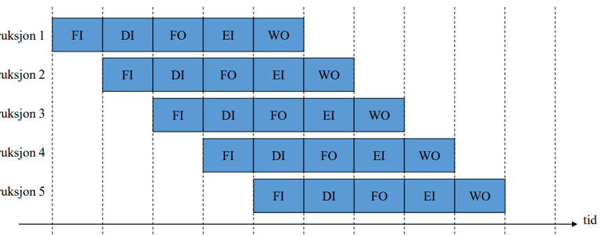

- mikro-ops er typisk 5 trinn:
    - FI: fetch instruction
    - DI: decode instruction
    - FO: fetch operand
    - EI: execute instruction
    - WO: write operand
    - 
- parallellitet gir problemer: flere instruksjoner kan trenge samme ressurs
    - resultatet som trengs i en instruksjon er ikke ferdig beregnet
    - kalles for hasarder
        - strukturell hasard: flere instruksjoner trenger samme ressurs samtidig
            - settes inn tomgangstrinn i siste instruksjonen
        - data-hasard: instruksjon trenger resultatet fra en annen instruksjon som ikke har resultatet klart enda
            - setter inn tomgangstrinn i siste instruksjonen
        - kontroll-hasard: hopp i programmet gjør at vi ikke vet hvilke instruksjoner som skal utføres før hoppinstruksjonen er utført
            - cpu må gjette hvor det skal hoppes: enkelt for ubetingede hopp, vanskelig for betingede hopp
            - feilgjetting gir pipeflush som sletter instruksjoner
- superskalare prosessorer
    - flere parallelle pipelines der antallet er cpuens grad av superskalar
        - grad 2 -> instruksjoner utføres parvis i pipeline
- dynamisk utførelse
    - dersom instruksjon må vente på minnet vil cpu begynne på senere instruksjoner selv om den ikke vet om de skal utføres
        - dataflytanalyse: finn ut hvilke instruksjoner som avhenger av hverandre
        - gjetting ved hopp: kun effektivt ved riktig gjett
        - spekulativ utføring: instruksjoner utføres gjerne ikke sekvensielt. resultatene legges i foreløpige registre og frigis dersom de stemmer