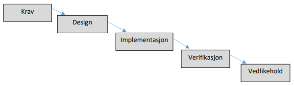
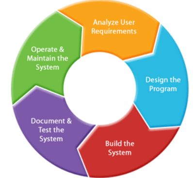
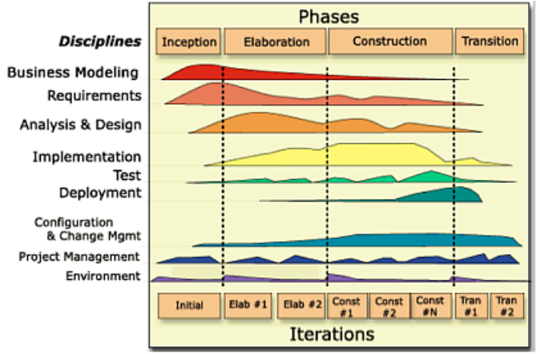
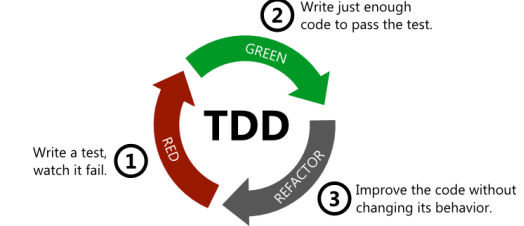
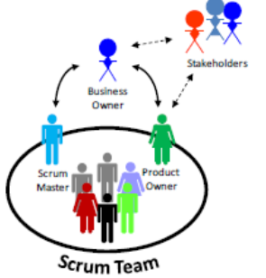

- intro
    - kommunikasjon
        - viktig med teknologi (god på programmering og andre verktøy)
        - men like viktig er kommunikasjon
        - består av spontan kommunikasjon og permanent dokumentasjon
        - muntlig uformell kommunikasjon
            - jobbe i samme rom fremmer kommunikasjon
            - forskjellig etg. gir mindre kommunikasjon
            - forskjellig bygg gir enda mindre kommunikasjon
        - muntlig kommunikasjon på møter
            - møter er egnet for større avgjørelser der alle får med seg kommunikasjonen
        - "model stormin"
            - skisserer modell på whiteboard og diskuterer
            - skjer i spontane møter for å løse et problem kjapt
            - kan lagres som en skisse
        - "vanlig" modellering
            - brukes for å permanent dokumentere omfattende og detaljert
        - skrevet dokumentasjon
            - skriver for alt som ikke kan modelleres
            - beskriver visjon/krav/ferdige systemet
            - nyttig for nye deltakere (beskrivelse av prosjektet)
- metodikk
    - vannfallsmodellen - 1970
        - vanligste utviklingsmetoden før
        - egne team for hver fase med mye skriftlig dok. og lite muntlig kom.
        - 
        - all dok. ble ikke lest
        - mange prosjekter ble store, tok lang tid, feilet
        - vanskelig å gå tilbake under produksjon når ting ikke fungerte som planlagt
    - unified process - 1999
        - 
        - i UP er iterasjoner sentralt
        - gjør ikke unna krav, analyse, design tidlig
        - gjennomfører sykluser og gjør dette flere ganger (iterativt)
        - evolusjonær eller inkrementell fordi man former/endrer kravene etter hvert som man erfarer i prosjektet
        - iterasjonene ble innført for å addressere problemet med vannfallsmetoden
            - å være i stand til å kunne endre krav
        - i utviklingsmetoden "scrum" konkretiseres en iterasjon i form av en "sprint" med konkret leveranse for hver sprint
        - UP har flere varianter
            - I starten var modellering og dok. omfattende
            - selv om iterasjoner ble innført, endte man med mye kravarbeid og design i starten
            - ble derfor mindre dok. etter hvert
            - på denne tiden var det klare skiller mellom roller, f.eks. arkitekt og utvikler
            - arkitekter var "hjernene", utviklere var "code monkeys"
            - med gode modeller og god dok., kunne man enkelt omrokere ansatte
            - uformell kommunikasjon ble oversett, noe som differerer fra "agil utvikling"
            - UP har fasene fra fossefall, men itererer dem over flere faser
            - 
- UML
    - UP og UML går hånd i hånd
    - begge er standarder vedlikeholdt av "object management group"
    - i dokumentmalene for UP spesifiseres bruk av UML-diagrammer
        - use-case-diagram, sekvens-diagram, domenemodell, klassediagram
    - UP er utdatert, men UML er oppdatert
- Agile Manifesto - 2001
    - da smidige (agile) metoder kom ble det applaudert
    - utviklere gikk fra "code monkeys" til viktigere prosjektdeltakere/arkitekter
    - "extreme programming" ble populært og prosjekter begynte å levere flere ferdige fungerende systemer
    - gikk raskere å levere første utkast, som ga motivasjon
    - paradigmeskifte i systemutvikling
    - de fleste vil si de driver med smidig utvikling, selv om det i praksis varierer
    - førte til fokus på teknologi og verktøy
    - design og dokumentasjon ble glemt
    - fungerte for enkle systemer, men ble problematisk med lite dok. i større systemer
    - "refactoring" skulle i stor grad løse designproblemer, men ble vanskelig lenger ut i prosjektet
    - ved tidspress på slutten blir "refactoring" nedprioritert, særlig dersom man har et fungerende system
    - resultatet ble at systemet er vanskelig å vedlikeholde
- XP
    - første smidige systemutviklingsmetoden
    - ble beskrevet i en bok skrevet av Kent Beck i 1999
    - nyskapende, og metoden inneholder prinsipper osm er gjeldende i dag, spesielt i Test-Driven Development
    - ble populært blandt utviklere, men skepsis blandt de høyere opp i systemene
    - nå skulle man nesten ikke dokumentere eller modellere
    - her som i TDD er det "refactoring" som skal sikre at koden får godt design
    - xp har 29 regler bl.a.:
        - programmer ALLTID parvis
        - lag alltid en enhetstest for det du skal lage FØR du skriver koden
        - ha en kort feedback-loop, hyppige tester, og tilbakemeldinger fra kunde skal resultere i kontinuerlige endringer
        - kjør ofte akseptansetester av større deler av systemet. disse lages fra user stories og bør være automatisert
        - ha korte iterasjoner med leveranser i hver av dem
        - ha fokus på enkel og tydelig kode. refaktorer med en gang koden begynner å lukte
        - skriv aldri kode du tror kan bli kjekk senere. dette er i kontrast til up-front-modellering (UP) hvor man gjerne prøver å lage noe flott og generelt som gjør at utvidelser skal bli enklere
    - parprogrammering er utmerket måte å utvikle kode på.
    - kan hende sjefen din ikke synes dette er en god utnyttelse av ressurser, men er mange tilfeller hvor det er det
    - utvikler felles plattform for hvordan man koder
    - får tenkt gjennom problemstillinger man har oversett
    - utfører "code review" kontinuerlig for å unngå bugs
    - i mange prosjekter utføres "code review" før man merger inn i master
- TDD
    - testdrevet utvikling er videreføring av xp
    - mer generell og inneholder ikke de 29 reglene
    - fokuset er det samme - tester driver utviklingen
    - tester = krav
    - user story beskriver funksjonalitet fra en brukers ståsted
    - hvis man detaljerer en user story med gode scenarioer eller akseptansekriterier vil dette fungere som tekstbeskrivelse
    - kan da gå gjennom scenariene manuelt ved en akseptansetest, men best å automatisere den
    - finnes verktøy som bruker user story-er med scenarioer og lager automatiserte akseptansetester
    - enhetstester fungerer på flere nivå
        - setter krav til en klasse
        - dokumenterer kravene
        - brukes til å validere (teste) at klassen virker som den skal
    - TDD er også iterativt
        - 
        - test-first: skriver test før eller samtidig, aldri etter
        - skriver kode etter testen (akkurat nok)
        - har nå mulig til å forbedre design
- Scrum
    - smidig prosess-metode som forteller om hvordan vi skal jobbe sammen og få god fremdrift i prosjektet
    - omfatter prosessen, men ikke utvikling/modellering
    - hovedpunkter:
        - team på 7-8
        - stand-up møter hver morgen (15 min)
        - sprinter (iterasjoner på et par uker) med klare mål for hver leveranse
    - teamet skal eksistere i beskyttet boble og kun ha kontakt med kunden via "product owner"
    - teamet, inkludert "scrum master" er flatt organisert
    - 
- lean software development
    - overføring av prinsipper fra lean manufacturing til software-utvikling
    - "implementing lean software development"
        - "eliminate waste" - forbedre effektivitet og kvalitet ved å eliminere overflødige elementer
        - think big: forstå helheten
        - act small: gjør litt av gangen
        - fail fast: finn feil asap
        - learn rapidly: lær av feil
    - 7 prinsipper
        - eliminate waste
        - amplify learning (create knowledge)
        - decide as late as possible (defer commitment)
        - deliver as fast as possible (deliver fast)
        - empower teams (respect people)
        - build integrity in (build quality in)
        - see the whole (optimise the whole)
    - lean legger hovedvekt på å unngå å gjøre/lage ting uten verdi
    - lean og agile handler om tilpasninggsdyktighet, kundesamarbeid, og teamwork

-