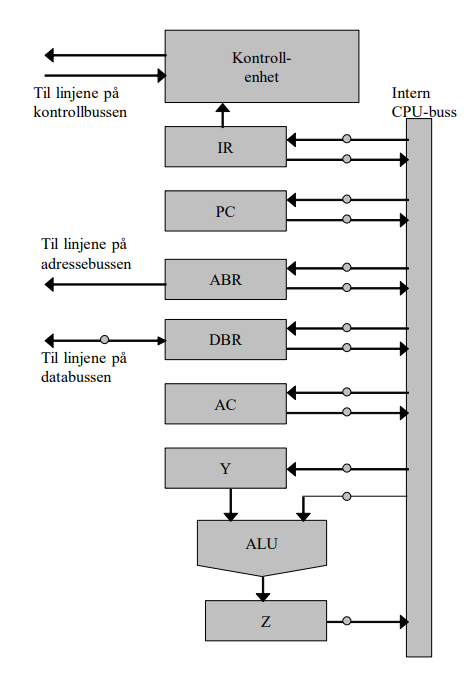

CPUens virkemåte og oppbygging
Instruksjonsformat

a) I forbindelse med instruksjonsformat snakker vi om opkode og operand. Hva er instruksjonsformat, og hva er opkode og operand?

CPUens ulike deler

a) Hvor lang tid tar det å utføre en mikrooperasjon? (Oppgi antall klokkepulser)

b) Mikrooperasjoner er som sagt operasjoner på lavt nivå. Det finnes tre typer mikrooperasjoner. Hvilke typer er dette?

Mikrooperasjoner

Anta en prosessor som er organisert slik som i figuren (som vi også har sett i leksjonen):

a) Hvilken funksjon har registrene Y og Z i en slik prosessor? Er disse registrene egentlig nødvendige?

b) Hvilken funksjon har registrene ABR og DBR?

c) Foreslå en sekvens av mikrooperasjoner som legger sammen to tall, a og b. Tallet a ligger i minnet og tallet b ligger i AC-registeret. Resultatet av addisjonen skal legges i minnet på samme lokasjon som tallet a opprinnelig lå. Anta at adressen til a ligger i operandfeltet til IR-registeret.

