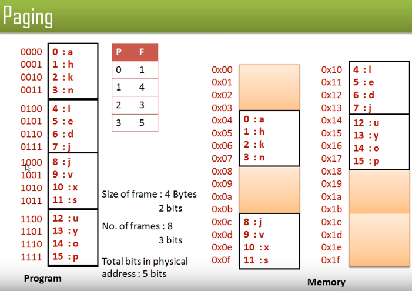

virtual memory

- address space a process can see
- dependent on cpu architecture (register size)
- f.eks. 2^64b memory

address translation consept

- virtual - translation - physical address if valid - data to cpu

address translation goals

- mem prot
- share
    - libs, intercom
- sparse addresses
    - regions of dynamic mem (heap/stack)
- efficiency
    - allocate mem
    - load
- portability
    - between os

virtually addressed base and bounds

- cpu sees virtual memory
- physically we need base and bound to define virtual memory
- translator gets addresses from cpu, sets base and bound based on that
- translator raises exception when out of range
- register new base and bound for each process

virtually addressed base bound

- pros
    - simple
    - fast
    - safe
    - can relocate in phys mem
- cons
    - cant keep program from overwriting own code
    - can't share data with other processes
    - can't grow heap/stack if base bound is static

segmentation

- contiguous region of vmem
- each process has segment table in hardware
- segment can be anywhere in phys mem
- processes can share segments
- offset = length from base to data we want to access
- need segment tabel for each process switch (context switch)

unix fork and copy on write

- unix fork makes copy of process including memory region
- segments allow more efficient implementation

zero-on-reference

- more effiecent way of zero out memory that needs to be used that did not belong to us before

segmentation

- pros
    - share data between processes
    - protectdata from overwrites
    - transparently grow stack/heap
    - detect if need to copy on write
- cons
    - complex mem management
    - need to defrag

paged translation

- manage mem in fixed pages
- finding free page is easy
    - bitmap shows free/not free location
    - frames in physical mem
    - pages in vmem
    - same size
- each process has own page table
    - in physmem

paged translation

- physical mem made of frames
- virtual mem made of pages

sparse address spaces
-

