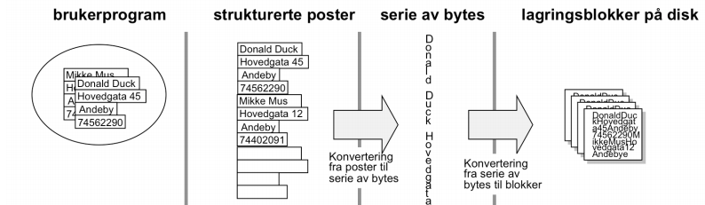
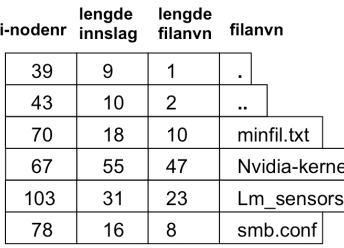
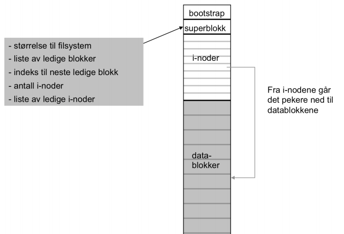
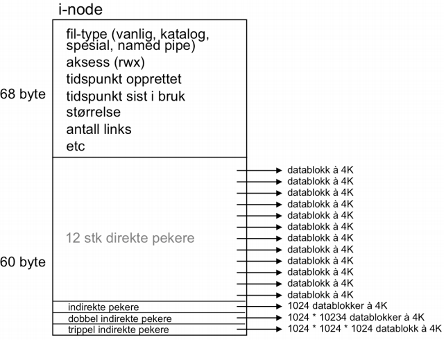
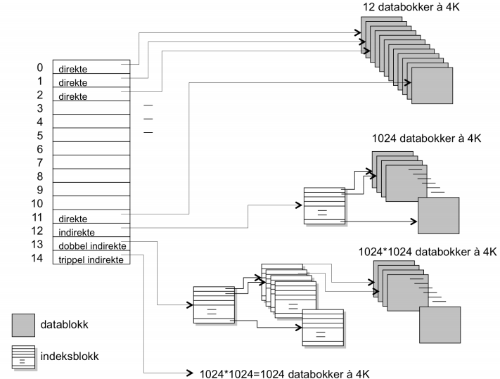
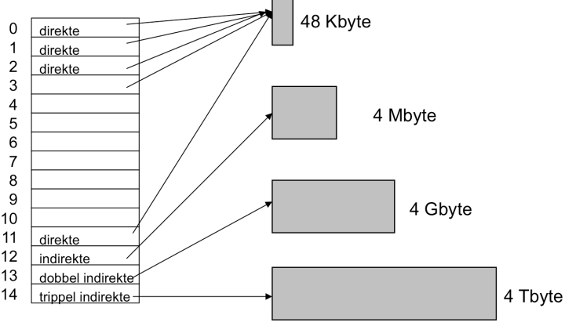
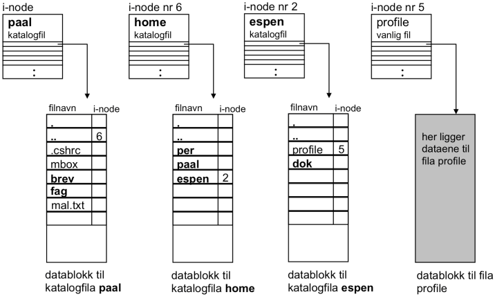

- main points
    - file systems
        - abstractions
    - storage charecteristics
        - memory devices
    - file system usage patterns
- file systems
    - abstractions
        - no need to think about details like speed, type
    - devices provide
        - storage that surivives machine crashes
        - block level (random) access (chunks of data, not streams)
        - large capasity, low cost, bottom of memory hierarchy
        - slow performance
- file systems as illusionists - hide limitations of phusical storage
    - persistance of data stored in file system even if
        - disk is writing

        -

    - naming
        - individual files, not blocks
        - directories for sorting
    - performance
        - cached data
        - data placement and data structure origanization
    - controlled access to shared data
        - permissions
- file system abstraction
    - file system
    - file: named collection of data
        - k
        - read/write or memory mapped
    - crash and storage error tolerance
        - if system crashes, we want to leave files in valid state
    - performance
        - os should go close as possible to hardware limit
- file system design
    - for small files
        - small blocks for efficiency
        - concurrent ops more efficient than sequential
        - files used together should be stored together
    - for large files
        - storage efficient (large blocks)
        - contiguous allocation for sequential access
        - efficient lookup for random access
    - may not know at file creation
            - whether file will be:
                - small or large
                - persistent or temp
                - used sequentially or randomly
- file system abstraction
    - dir
        - group or named files or subdirs
        - mapping from file name to metadata location
    - path
        - string that identifies file or dir
    - links
        - hard link: link from name to metadata loc
        - soft link: link from name to alternate name
    - mount
        - include external memory in system directory
    - unix file system api
        - create, link unlink, createdir, rmdir
        - open, close, read, write, seek
    - fsync
- file system interface
    - unix file open is a swiss army knife
        - open file, return file descriptor
        - options
        - s

norsk kompendium (fil-administrasjon)

- hva er en fil?
    - generelt
        - abstraksjon av harddisken
        - harddisken blir arkivskap med deler av harddisken partisjonert til filer
        - abstraksjonen kalles filsystem (fil-administratoren)
        - filsystemet har funksjoner (systemkall) for å aksessere filer
        - filsystemet må beskytte filer
            - skille os-filer og bruker-filer
    - struktur eller ikke på filene?
        - i linux tilbyr filsystemet en serie av bytes til programmene
        - opp til programmene å strukturere data
        - 
        - linux er et lav-nivå filsystem fordi det tilbyr strøm av bytes
        - høy-nivå filsystemer (IBM-stormaskiner) har filsystem i os
        - faget fokuserer på lav-nivå-filsystemer
    - filer som byte-strøm
        - linux betrakter filer som byte-strøm, hver byte indekseres
        - bytepeker indikerer hvor det leses
        - datablokker lagres på disk, konverteres til byte-serie for å leses med peker
        - i tillegg til data i filen, lagres fildeskriptor med:
            - filnavn (string): brukes av brukeren. linux bruker inode-nr for id
            - eier: bruker som eier filen
            - tilgangsrettigheter: hvilke brukere som har tilgang og hva slags rettigheter
                - tre kategorier i linux: owner, group, others
                    - kan tildeles rettighetene: read, write, execute
            - størrelse: antall bytes
            - tidspunkt for opprettelse, endring, siste aksess
            - referanser: antall referanser fra andre filer i kataloghierarkiet
            - datablokker: pekere til datablokker på disken der innholdet til filen lagres
            - administrative data om når filen brukes, åpnes, leses. må da kunne lagre byte-peker
    - operasjoner på filer
        - os-et tilbyr funksjoner til brukerprogrammer
            - open

                -

            - close

                -

            - read

                -

            - write

                -

    - driver-nivået
        - lesing av filer
            - overføring av datablokker mellom disk og os, egne buffere for mottak
            - blokkstørrelse er tilpasset disken
            - bytes sendes videre fra os til programmet
            - ber programmet om mer data, kan det hentes fra buffer om det finnes der
        - skriving av filer:
            - samme system. data bufres
            - når buffer er full, skrives data til disk
            - (flere write-kall for å fylle opp buffer)
- utlegging av datablokker på
        - når data skrives til disk, skal blokkene være sammenhengende eller spres tilfeldig på disk?
    - kontinuerlig allokering
        - kontinuerlig lagring av datablokker på disk
            - må finne langt nok sammenhengende område
            - ulempe: problematisk dersom filer vokser
            - fordel: lese/skrive uten å flytte peker
    - lenket allokering
        - datablokker lagres random i blokker
        - filkatalog har første og siste blokk
        - mellomblokkene aksesseres ved peker til neste nederst i hver blokk
        - ulempe: skal aksessere nest siste blokk: må gjennom alle først pga. mangel på indeksering
    - indeksert allokering
        - samle alle blokk-adresser til egen indeks-blokk i filkatalog
        - fordel: unngår gjennomgang av alle blokker
        - fordel: filen kan vokse pga. random blokk-allokering
        - ulempe: krever minst to blokker for indeks og data
    - ledig liste
        - os kontrollerer ledige blokker "ledigliste" som viser opptatt/ledig for hver blokk
        - eks. på ledigliste:
        - 
        - ulempe: sammenhengende område er vanskelig å finne
- filsystemet til Linux
    - kataloger
        - katalogfil: inneholder navnene til filene i denne katalogen og inode-nr
            - ls  -l -> listes med "d" ytterst til venstre
            - kan kun endres ved kommandoer
            - vanligvis 4096B (èn blokk), øker dersom antall filer blir stort
            - i-nodenr: intern id til filen som peker på fildeskriptor
            - lengde innslag: filstørrelse i B
            - 
- i-noder
    - nr brukes for å hente mer data om filene
        - vises med ls -al o.l.
    - ligger lagret et sted på disk i stor tabell med alle i-noder til alle filer
        - linux begrenser derfor antall filer basert på i-node-tabell-størrelse
            - (samme for prosesser)
            - 
    - katalogfiler har også inoder og datablokker. inoder inneholder data om katalogfilene, datablokkene inneholder katalogfilen sine data, dvs. inodenr og filnavn
    - innholdet til inoden
        - data om filen
        - hvor datablokkene er på disk
        - 
        - tre siste adressene peker til indeksblokker med adresser til datablokker (opptil 3 nivåer i Linux)
        - adressering av datablokker via indeksblokker
            - 
            - nederste delen av inoden (adressene til datablokker på disk) datablokker markert grå, indeksblokker markert hvit
            - 12 første adressene til inoden som peker direkte til datablokker på disk
                - hvis filen er mindre enn 12*4K=48K, går det raskt å pga. direkte aksess
                - > 48K -> gå via indeksblokker.
                    - hente indeksblokka fra disk
                    - her finnes adresser til diskblokkene fra filen
                    - via indirekte peker (nr 12) nås første indeksblokka som kan adressere til sammen 1024*4K=4MB
                    - 1024 fordi en indeksablokk på 4K inneholder 1024 blokkadresser á 4 B
                        - små filer går direkte, større går gjennom indeksblokker, innebærer flere oppslag på disk for å hente inn i minne
                    - mulig str. på filer i Linux med 4K datablokker:
                    - 
    - aksess til linux-fil
        - når vi aksesserer bruker vi ofte komplett sti for at os-et skal finne fram
        - filkommando-aksess -> slår opp i hver katalogfil fra root for å finne neste undermappe, til slutt målfil
            - først sjekkes inoden for å sjekke brukeraksess
            - deretter brukes inoden til å finne adresser til datablokker som tilhører filen
            - kommando utføres
        - 
        - katalogfiler og vanlige filer har inoder med angitt str i B, aksess-rettigheter, siste endring osv.
        - katalogfiler og vanlige filer har datablokker. i katalogfiler finnes kun filnavn og inodenr som data
        - for hvert steg gjennom sti-navnet:
            - hentes en ny inode og rettigheter sjekkes
            - sjekkes om neste navn finnes i datablokka til katalogfilen
        - katalogfiler er typisk små
            - hele får vanligvis plass på første blokka
                - derfor er de 12 første adressene  på inoden direkte
                - katalogfiler brukes mye, så rask tilgang fås ved å gå vi indeksblokker
        - små config-filer nås raskt fordi intill 48K kan nåes via de 12 direkte-pekerne som finnes i inoden til filen
        - Linux bruker mange oppslag på disk ved aksess, spesielt ved lange sti-navn. minneadministrasjon sørger for å minimalisere antall aksesser ved å cache
- lenker til Linux-filer
    - kataloger og lenker
        - Linux kan ha flere referanser til samme fil
            - typisk for katalogfiler (har flere referanser pekende på seg)
    - harde lenker
        - nytt innslag i katalogfilen med samme inode-nr som originalfilen
        - de peker da til den samme fysiske filen
        - felles databloker
        - endringer for rettigheter  vil gjelde for begge filene
        - nn eksisterendefil.txt nyfil.txt
        - antallet lenker i eksisterendefil øker med 1
    - symbolske lenker
        - ny fil med eget inode-nr, egne datablokker
        - representert ved en fil, innholdet (datablokken) er en sti til originalfilen
        - ln -s eksisterendefil.txt nyfil.txt
        - markert med bokstaven l først på linja for ls, hvilken fil lenken peker på bakerst