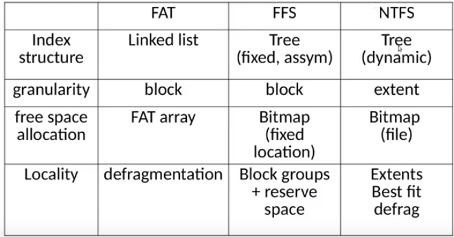
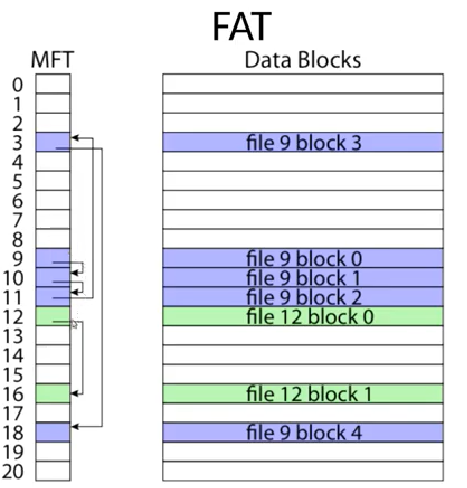
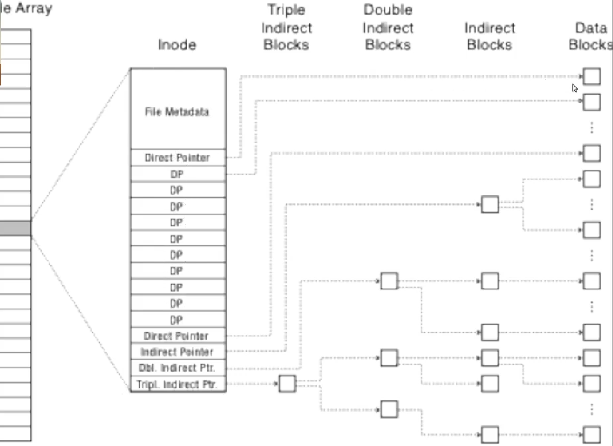
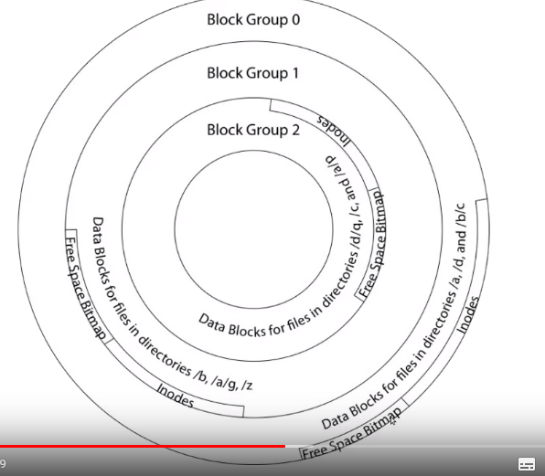
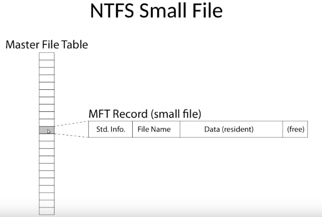
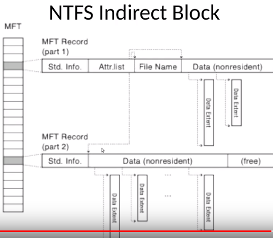
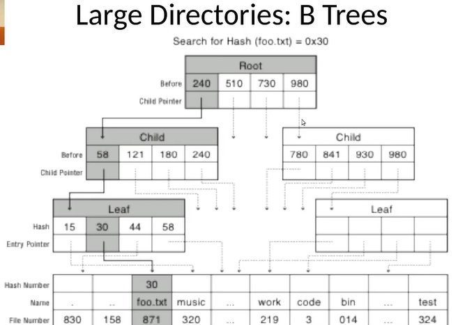
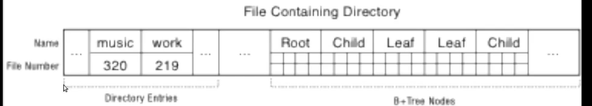

    - file system design
    - file -> metadata
    - metadata: how to find file data blocks (possibly free map also)
    - free map: list of free disk blocks (bitmap: free or occupied cell)
- how do we organize these data structures
- design challenges
    - index structure
        - how to locate file blocks
    - index granularity
        - what block size do we use
    - free
- file system design options
- fat
    - linked
- ntfs

- directories
    - directory file in each directory with files and block id
    - 1..* blocks per file
    - deleting file only deletes from table
    - fragmentation is file blocks scattered between each other as files are created, deleted, modified
    - defragmenting is rearranging blocks
- hierarchy
    - metadata  column "is dir?" for identifiing file or folder
    - moving object between folders only switches place in directory files table

    -

- main points
    - file systems: FFS (linux), FAT, NTFS (microsoft)
    - file layout
    - directory layout
- file system design constraints
    - for small files
        - small blocks for storage efficiency
        - files used together should be stored together for shorter seeks
    - for large files:
        - contiguous allocation for sequential access
        - efficient lookup for random access
    - may not know at file creaton
        - whether file will become small or large
- file system design
    - data structures
        - Store directories as files by indexing systematically
        - allow for finding files, reading, writing, finding metadata
        - directories: container that maps file name to file metadata
            - can store dir as files, where dir contain mapping from location on disk to another file
        - file metadata: how to find file data blocks (where data blocks start)
        - free map: list of free disk blocks
    - how do we organize these data structures?
        - device has non-uniform performance
- design challenges
    - index structure
        - how do we locate the blocks of a file?
            - path
        - index granularity
            - what block size do we use?
        - free space
            - how do we find unused blocks on disk?
                - free map
        - locality
            - how do we preserve spacial locality
                - store together for efficiency
        - reliability
            - what if machine crashes in middle of a file system op?
                - handle with doing whole transaction or nothing
- file system design options
    - 
- named data in a file system
    - 
        - from file name offset
        - gives us a directory
        - inside directory: list of file names and file numbers -> file number offset
        - file number is mapped to storage block on disk
    - from logical mapping (what we understand) to physical mapping
- microsoft file allocation table (FAT)
    - can't have metadata (file owner, permissions, access times..)
    - linked list index structure
        - simple and easy to implement
            - still widely used (usb drives)
    - file table
        - linear map of all blocks on disk
        - each file is a linked list of blocks
    - 
    - link to next block at the end of each block
    - can be used as free space map
    - pros
        - easy to find free block
        - easy to append to file (increase linked list)
        - easy to delete file (remove entry in mft (master file table)
    - cons
        - small file access is slow
        - random access very slow
        - fragmentation
            - no guarentee of spacial locality, just choosing the next available block
            - file blocks for given file may be scattered
            - files in same directory may be scattered
            - worse as disk fills
- berkley unix ffs (fast file system) (todays linux file systems inherit this)
    - inode table
        - similar to FAT table
    - inode
        - can store metadata
            - file owner, access permissions, access times,
            - only these users should see file etc.
            - set of 12 data pointers
                - with 4KB  blocks -> max size of 48KB files
            - indirect block pointer
                - pointer to disk block of data pointers
            - indirect block: 1K data blocks -> 4MB (+48KB)
            - doubly indirect block -> 1K indirect blocks
                - 4GB (+4MB + 48KB)
            - triply indirect block pointer
                - triply indirect block -> 1K doubly indirect blocks
                - 4TB (+4GB + 4MB + 48KB)
        - 
        - inode array
            - each entry has an inode
                - metadata
                - 12 direct pointers
                - 12 * 4KB block size = 48KB
    - ffs asymmetric tree
        - small files: shallow tree
            - efficient storage for small files
        - large files: deep tree
            - efficient lookup for random access in large files (compared to linked list)
        - sparse files: only fill pointers if needed
    - ffs locality
        - block group allocation
            - block group is a set of nearby cylinders
            - files in same directory located in same group
            - subdirectories can be located in different block groups
        - inode table spread throughout disk
            - inodes, free space bitmap located near file blocks they relate to
        - first fit allocation
            - small files can be fragmented, large files should be contiguous
            - 
    - ffs first fit block allocation
        - fits the first free block into the block array
    - pros:
        - efficient storage for small and large files
        - locality for small and large files
        - locality for metadata and data (inodes and bitmaps stored together)
    - cons
        - inefficient for tiny files (a 1 B file requires both an inode and a data block)
        - inefficient encoding when file is mostly contiguous on disk (no equivalent to superpages)
        - need to reserve 10-20% of free space to prevent fragmentation
- NTFS
    - master file table
        - flexible 1KB storage for metadata and data
    - extents
        - block pointers cover runs of blocks
        - similar approach in linux (ext4)
        - file create can provide hint as to size of file
    - journalling for relaiability
        - commited or not commited
    - NTFS small file
        - 
        - master file table (similar to fat table
            - file name to file number inside (mft record inside)
                - file metadata, name, data, (free space)
                - non resident data is similar to indirect data block pointer
                - resident data is similar to direct data block pointer
                - difference is that because we don't have fixed block size, we point to start of extent and length
    - NTFS indirect block
        - 
        - can have a case where mft record is too large for a single mft block
            - can have a pointer from end of eg. attr.list to another mtf record where list is continued from the pointer
- all file systems go from logical to physical storage different ways
    - logical being file name offset given file number -> storage block on disk
- directories are files
- large directories: B trees
    - 
- large directories: layout
    - 
- summary
    - issues with designing a file system
        - fat
            - still used in usb drives
            - prone to defrag
            - poor performance for random access etc (linked list is poor for random access)
        - ffs and ntfs
            - better performance for random access (hash tables) because of tree structure
    - different ways to optimize for spacial locality
        - levels of indirections
            - for large and files
        - first fit alloaction with ffs
            - small files fragmented, large files contiguous
    - ntfs
        - don't have blocks, but extents
        - if attributes don't fit into one mft record, we can continue in 2nd linked record

        -