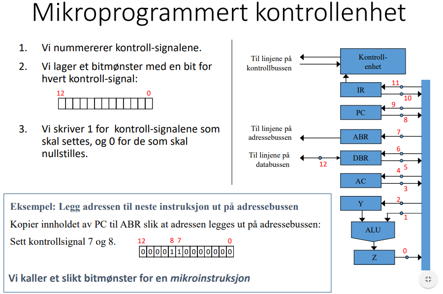

oppgave

    - sekvensiering - steppe gjennom mikroinstruksjoner i rett rekkefølge, som bestemmes av programmet
    - eksekvering - bruker kontrollsignaler for å kommunisere/velge ALU-operasjon
    - setter opp ny kombinasjon styresignaler ved hver klokkepuls for å utføre rett mikro-op
- funksjon
    - innsignal
        - IR
        - klokke
        - kontrollbussen
    - utsignal
        - interne cpu-kontrollsignal
        - kontrollbussen
- oppbygging
    - hardlogikk (RISC) - kun elektronikk - raskere
    - mikrokontrollert (CISC) - sjekker input-bitmønster i minnet, og sender ut tilsvarende bitmønster
        - 
    - forskjellen
        - hardlogikk er komplisert, men raskt (ps), begrenser funksjonalitet
        - mikrokontrollert er enkelt, men tregere pga. minneaksess (ns)
        - finnes hybrid-løsninger der begge brukes, eller der cisc oversettes til risc
- optimalisering
    - øke f
        - begrenses av varmgang
        - forbedres ved moores law fordi deler blir mindre -> mindre varme
    - forbedre arkitektur
        - avanserte mekanismer gir flere operasjoner pr klokkesyklus
        - avgjørende mekanismer:
            - pipeline
            - superskalar arkitektur
            - dynamisk utføring