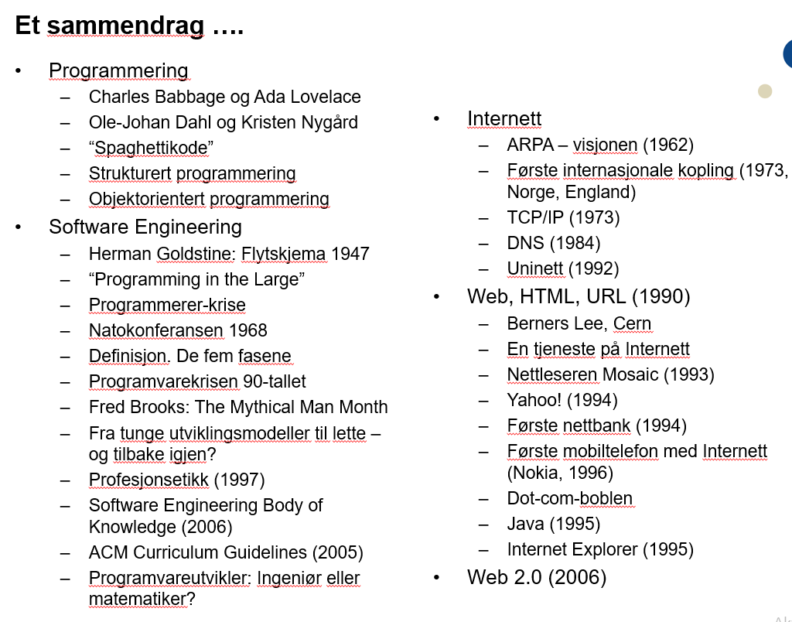

1.
2. læringsutbytte: historie og utvikling
3. sitater
    1. feilvurderer utviklingen
4. progging i algol og fortran slutten av 70-tallet
    1. puncheskjema for hullkort, kortstokk ga et program
    2. terminaler
5. fortran var lavt nivå
6. systemutvikling
    1. store konsekvenser av små feil
7. computer engineering - programmeringens begynnelse
    1. matematiker Charles Babbage ønsket å lage ikke-spesialisert regnemaskin

    2. Ada Lovelace beskrev hvordan maskinen kunne mates med ulike instruksjoner for å gjøre beregningene som var ønsket, første programmerer

8. software engineering - tidlig historie
    1. Herman Goldstine: flow charts
    2. instruksjoner, systematikk, begrenset minne
9. software engineering - utvidelse
    1. høyere nivå
    2. multiprosessering
    3. avansert programvare
    4. starten på utdannelse
10. software engineering - eget fagflet
    1. spesifisere systemet etter bruk
    2. designe (strukturert)
    3. programmere (billig effektivt, forståelig)
    4. teste (for bugs, parallelt med designing)
    5. vedlikehold (overstiger utviklingskostnadene)
11. software engineering - krise
    1. feil produkt til feil pris, prosjekter lyktes ikke
12. software engineering - dokumentasjon
    1. verktøy, metoder, utviklingsprosesser
13. forbedring
14. oop-begynnelsen
15. software engineering - 1990-1999 - internett kommer
    1. open source, internasjonalisering, flere brukere
    1. nye produkter (søkemotorer, oversetter, web-apps
16. 2000+
    1. hyperdigitalisering (sky, medier, mobiler, tingenes internett)
17. ingeniør eller matematiker?
18. nett mellom nett
    1. arpa
    2. TCP/IP
    3. dns
19. www
    1. html og nettleser
    2. java, applets
    3. internet explorer
20.
