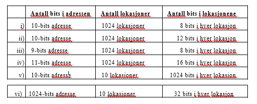

*Institutt for informatikk og e-læring, NTNU*

Teoriøving i Datateknikk

Geir Ove Rosvold

Primærminne

Oppgave  1

a)  Hva er typisk aksesstid for DRAM?
35-70ns
b) Hva er typisk aksesstid for SRAM?
 1-10ns
c)  Hvilken minnetype brukes i primærminne, og hvilken brukes i cache?
 DRAM i primærminne og SRAM i cache.

d) Forklar hvorfor størrelsen på lagerbrikker som regel har økt med en faktor på fire pr. generasjon (fra 1M til 4M til 16M osv)

e)  (Vanskeligere) Kan du tenke deg hvorfor kvadratisk organisering av lagerbrikkene er lite brukt for ROM-brikker?

Oppgave  2

*Denne oppgaven er enkel!*

*Mange tror den er fryktelig vanskelig og roter seg inn i kompliserte resonnement.*

*Ikke gjør det. Tenk enkelt.*

Nedenfor finner du en oversikt over seks ulike måter å organisere primærminne på. I tabellen vil du for hver av primærminnene finne:

    Antall bits som brukes til å adressere minnelokasjonene i primærminnet.

    Antall minnelokasjoner i primærminnet.

    Antall bits som lagres i hver minnelokasjon.

Hvilke av disse organiseringene er mulige, og hvilke er helt umulige? Hvilke er hensikts- messige? (Begrunn alle svarene. )

2