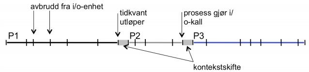
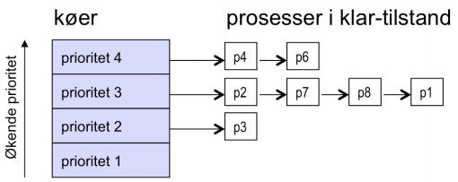

- intro
    - scheduling threads and processes
    - unicore and multicore
- main points
    - scheduling policy: what to do next
    - definitions
    - response time, throughput, predictability
    - uniprocessor policies
        - fifo, round robin, optimal
        - multilevel feddback as approximation of optimal
    - multiprocessor policies
        - affinity scheduling, gang scheduling
    - queueing theory
        - predict/improve system response time
- example: web site becomes too popular
    - buy hardware: more cost
    - implement scheduling policy: more overhead
    - turn away users: lose potential
- definitions
    - task
        - job e.g. mouse click
    - throughput
        - how many tasks per time
    - overhead
        - extra work in choosing next task
    - fairness
        - how equal is performance received by different users
    - predictability
        - how consistent is performance over time?
        - same response time?
    - workload
        - set of tasks for system to perform
        - either cpu or io
    - preemptive scheduler
        - if we can take resources away from a running task
        - normal in modern os
        - if not, process has to voulentarily give up cpu
    - work-conserving
        - resources are used whenever there is a task to run
        - for non-preempltive schedulers, work-conserving is not always better
    - scheduling algorithm
        - takes wokload as input
        - decides which tasks to do first
        - performance metric (throughput, latency) as output
        - only preemptive, work-conserving schedulers to be considered
- FIFO
    - schedule tasks in order they arrive
        - continue running them until they complete or give up cpu
    - example: memcached
        - facebook cache of friend list
    - on what workloads is fifo bad?
        - long job running, short jobs queued
- SJF
    - (shortest remaining time first)
    - optimal for average response time
    - however can starve long jobs
- fifo
    - optimal for fixed number of tasks
    - low overhead
- starvation and simple bias

    -

- cpu-administrasjon
    - mekanismer for scheduling
        - cpu-kø: prosesser i kø for bruk av cpu, må administreres bra
        - prosesser i kø er ready
        - prosesser må utføre i/o-operasjoner og deretter komme tilbake til kø
        - scheduler administrerer køen basert på kriterier (respons, throughput)
        - virkemåten til scheduler
            - bestemmer cpu-tid og skiftet av prosesser: hvordan en prosess allokeres/deallokeres til cpu
            - klar prosess havner i kø
            - køen er en liste med minneadresser som peker på p-deskriptoren til hver prosess
            - scheduler kan ordne listen etter pri (fifo/sjf...)
            - scheduler består av dispatcher og context switcher
                - dispatcher
                    - velger neste p som skal kjøre på cpu (basert på pri/køplassering)
                    - har tilgang til til p-deskriptor for å bestemme pri-verdier
                - context switcher
                    - bytter til prossess valgt av dispatcher
                    - bytter ved å flytte data for kjørende prosess fra cpu til p-deskriptor og motstt for neste som skal kjøre
                - prosesser blir ferdige av forskjellige årsaker:
                    - ferdig
                    - ber om ressurs
                    - fratatt cpu fordi tiden utløper eller gir fra seg cpu frivillig
        - prosesskifte
            - kontekst-skifte: prosesser skifter på å bruke cpu
            - ved hvert skifte skjer 4 kopieringsoperasjoner (kontekstskifter) mellom p-deskriptor og cpu når ny p skal inn på cpu
            - to kopieringer for bytte av prosesser (flytte data cpu-registre - p-deksriptior), to kopieringer fordi scheduler må kjøre på cpu for å utføre kontekstskifte
                - 1. når kjørende p er ferdig, lagres data i pd
                - 2. scheduler gjøres til kjørende p for å dispatche
                - 3. når scheduler er ferdig flyttes data fra cpu-registre til schedulers pd
                - 4. data fra pd til ny prosess flyttes til cpu og p kjører
            - en viss kostnad med å skifte mellom p
            - kjøre prosesser "samtidig" krever mye administrasjon av cpu for å redusere kostnad
        - scheduling-strategier
            - hvilken scheduling-strategi kommer an på hva slags os
            - prioriteres ut ifra viktighet
            - dersom situasjonen er flere brukere, må det tildeles fair mellom brukerne ift. tid/responstid
            - total cpu-tid: tiden p bruker cpu, ekskludert ventetid for i/o ol.
            - ventetid: tiden p står i kø (responstid)
            - omløpstid: tiden fra p stilles i kø til fullført
            - gjennomstrømning: p/t
        - tidskvant
            - med flere p tildeles cpu-tid etter fast størrelse
                - ingen p kan ta over hele cpu og ta monopol
                - p som kjører vil time ut etter en tidskvant
        - preemptive og ikke-preemptive cpu-administrasjon
            - metodene for scheduling deles i to (preemptive = forkjøpsrett ol.)
            - ikke-preemptiv: avgir ikke cpu før ferdig
            - preemptiv: os kan gripe inn og skifte p
        - skifte av prosesser og avbrudd
            - p som får cpu kan fortsette til høyere pri ankommer eller p fullfører
            - ila. tiden p kjører vil det komme avbrudd fra f.eks. i/o-enheter
                - må håndteres der og da med avbruddsrutine
                - tar kort tid, cpu gis tilbake etterpå
            - 
            - cpu-er kan ha ekstra sett registre for avbruddsbehandling får å slippe å bytte ut registre, kun bytte sett
    - ikke-preemptiv cpu-scheduling
        - gir lav kostnad pga. få kontekstskifter
        - tillater at p kjører til den er ferdig. finnes ingen vei tilbake til køen
        - first-come-first-served (fcfs)
            - lite overhead, men kan forsinke små prosesser
            - tilsvarende FIFO
        - shortest job next
            - mindre gjennomsnittlig ventetid men kjøretiden må være kjent på forhånd
        - prioritet
            - prosesser har gitt prioriteter basert på f.eks. hvor mye ressurser p krever
            - ulempe: lav pri kan får lite kjøretid (starvation)
    - preemptiv cpu-scheduling
        - kjørende p kan bli avbrutt og erstattet
        - hver gang ny p q-es vil scheduler aktiveres for å sjekke pri
        - hvis pri er høyere enn kjørende, byttes den inn
        - scheduler starter også når tidskvanten utløper, og p re-q-es
        - sikrer rask responstid for p med  høy pri, gir fair tidsfordeling
        - høyere kostnad pga. mange kontekstskifter
        - round-robin
            - vanligst
            - cpu-tid fordeles likt
            - hver p får tidskvant, re-q-es om den utløper
            - lengden av tidskvant må sees i relasjon til kontekstskifte-tiden
                - lite tidskvant gir
                    - for mye skifte (overhead)
                    - god responstid fordi din p kommer til fort
                - mye tidskvant gir
                    - mindre skifte, mindre overhead
                    - større responstid fordi hver p kan bruke lenger tid
                - velger mellomstor tidskvant: 10-50 ms per p
        - fler-nivå cpu-køer
            - p kategoriseres i klasser basert på hvor ofte de trenger cpu og hvor lang totaltid det er snakk om
            - finnes i/o-bundne p som kun bruker cpu for i/o (i kort tid)
                - typisk interaktive prosesser (tekstbehandlere)
            - cpu-bundne prosesser bruker cpu lenge hver gang
                - utfører sjeldent i/o
            - finnes p i mellomstilling
            - p-er kan bytte mellom i/o- og cpu-bundet
            - scheduling-metoder må forholde seg til begge typer
            - dette er mulig med fler-nivå cpu-køer
            - 
            - scheduler prioriterer p-er med lavere tidskvant
            - poenget er at scheduler prioriterer ved å se på hvem som er raskest
            - dersom p bruker opp tidskvant, faller den ned med økende tidskvant
            - cpu-bundne ligger ofte nede
            - i/o-bundne ligger ofte på topp
            - dette gjør at brukere får rask responstid med i/o-utstyret
            - prosesser på bånn blir ikke starved fordi øverste bruker kort tid