- intro
    - modellbasert sys.utvikling (MBSE)
        - har kompakt språk
        - uml kan beskrive
            - krav til komponenter og systemet som helhet
            - systemets struktur
            - oppførselen til og samarbeidet mellom komponentene i systemet
        - visualiserer og kommuniserer et design som kan uttrykkes og deles med andre
    - hvorfor modellerer vi?
        - utforme et design
        - kommunisere et design
        - dokumentere et design
        - visualisering gjør det lettere å forstå helheten
        - mer kompakt og mindre tidkrevende
- diagrammer
    - use case-diagram: gir oversikt over brukstilfellene (use case ) i et system. I tillegg beskrives hvert brukstilfelle tekstlig.
        - 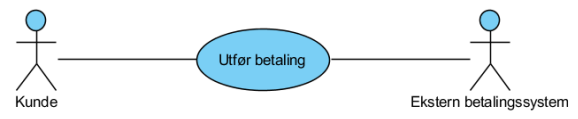
    - aktivitetsdiagram: beskriver hvilke aktiviteter som er involvert for å få gjennomført et brukstilfelle, hvilken rekkefølge de utføres i og eventuelle betingelser som er involvert
        - 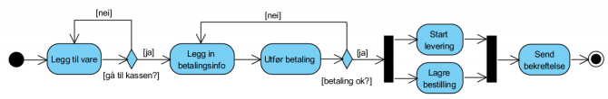
    - tilstandsmaskin: brukes for å beskrive mulige tilstander til objekter i systemet og hvilke hendelser som utløser tilstandsendringer
        - 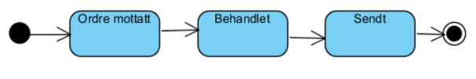
    - sekvensdiagram: brukes for å beskrive hvilke meldinger som sendes mellom objektene i systemet for å kunne gjennomføre et brukstilfelle, og i hvilken rekkefølge dette gjøres.
        - 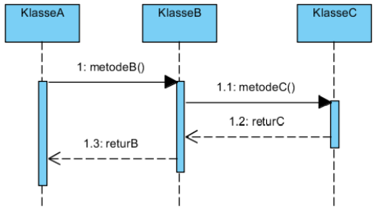
    - klassediagram: brukes både til å beskrive kode detaljert og til å beskrive de viktigste entitetene i et domene (domenemodell)
        - 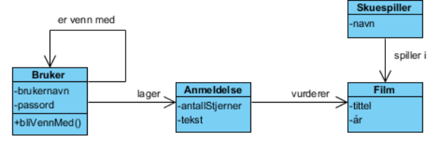
- use case diagram
    - typisk og spesifikk brukssituasjon av systemet
    - ovale sirkler inneholder verb
    - aktør(er) assosieres med brukstilfelle med enkel linje
    - include
        - et brukstilfelle er en obligatorisk del av et annet tilfelle
        - 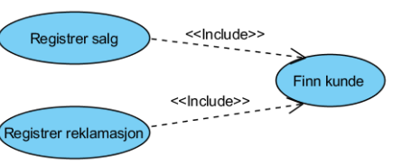
        - kan gjenbruke brukstilfellet "finn kunde"
    - extend
        - brukstilfellet er ikke en obligatorisk del av et annet, men blir utført i spesielle tilfeller
        - har derfor gjerne en betingelse assosiert med seg
        - pila går motsatt vei
        - tilleggs-caset utvider base-caset
        - 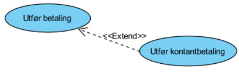
    - systemgrense
        - boks rundt brukstilfellene som tilsvarer et system
    - use cases (handlinger/verb entitetene utfører)
- use case - tekstlig beskrivelse
    - beskriver hvert brukstilfelle i detalj
    - 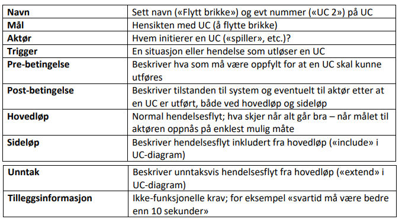
- aktivitetsdiagram
    - hvilke aktiviteter som er involvert for å få gjennomført et brukstilfelle
    - hvilken rekkefølge de utføres
    - hvilke som kan kjøre i parallell
    - eventuelle betingelser som er involvert
    - egner seg for komplisert programflyt (mye if/goto eller i forretningsprosesser/arbeidsflyt) eller mindre prosesser
    - (sekvensdiagram egner seg for oop)
    - 
    - symboler
        - bokser representerer aksjoner (verb)
        - sirkler representerer start/slutt (ekstra sirkel rundt sluttnoden)
        - fork/join med tjukke stolper
        - diamant for spørring
    - swim lanes
    - fordeler aksjonene over aktørene
        - 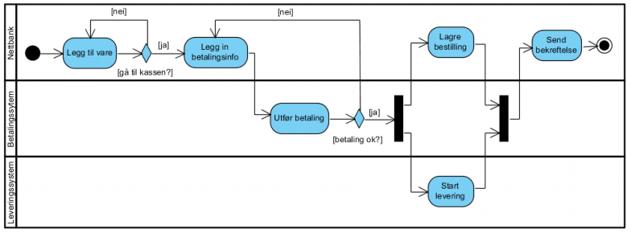
- tilstandsmaskin
    - illustrerer hvilke tilstander et objekt kan være i og hva som gjør at de endrer tilstand
    - 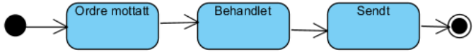
    - start- og slutt-tilstand
    - nøsting
        - ved betaling feilet, kan kontrollflyten gå tilbake til et tidligere punkt med en node
    - sidenavigasjon
        - å være på en side kan være en tilstand
            - 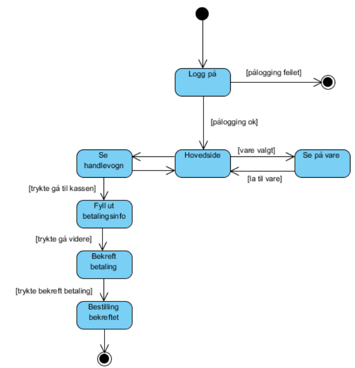
            - hver tilstand byttes ved en condition
- klassediagram
    - domenemodell
        - entiteter og forholdet mellom dem
        - 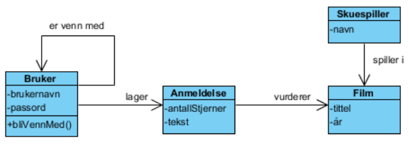
        - skal være ukomplisert og forståelig for kunder
        - utvikles i samarbeid mellom domeneeksperter og utviklingsteamet
        - ligner på databasemodell (ER-diagram), men hensikten er en annen
            - domenemodellen er mer konseptuell og overordnet beskrivende
            - ER-diagram kommer i senere detaljert modellering, f.eks. databasemodellen
            - ER-modell inneholder flere attributter, men ikke operasjoner
        - vi tar med:
            - navn på assosiasjoner mellom entitetene
            - viktige attributter på entitetene
            - viktige metoder/operasjoner
            - multiplisitet hvis det er viktig for forståelsen av forholdet mellom entitetene
            - notater/kommentarer dersom noe er uklart
- sekvensdiagram
    - representerer meldinger mellom komponenter i systemet
    - komponentene kan være:
        - klasser fra et program
            - 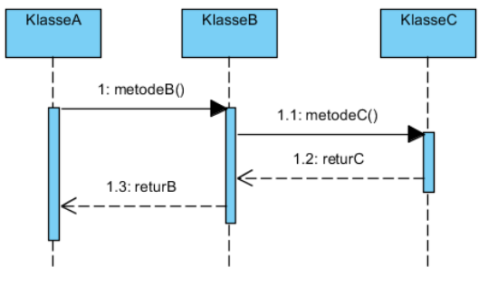

            -

        - domeneobjekter fra domenemodellen
        - subsystemer i et større, sammensatt system
            - kalles system-sekvensdiagram
            - eks. ved 3 subsystemer:
                - 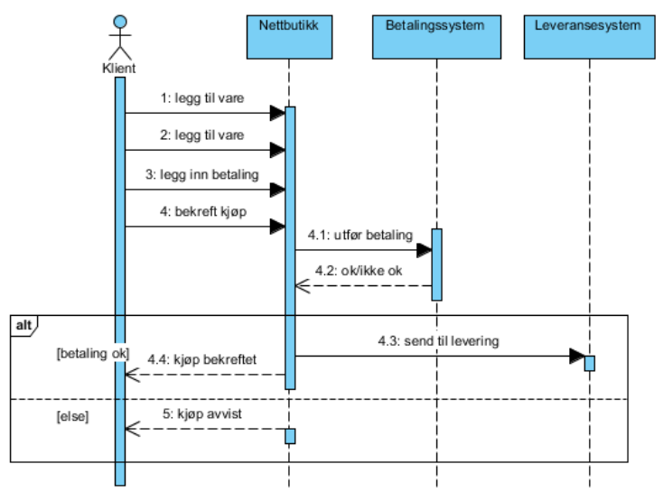
                - numererer handlinger for å vise rekkefølge
                - alt viser resultatet av hver forgrening
    - klasser
        - representeres med bokser: "instans: klasse"
            - 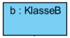
            - bruker vanligvis ":klassenavn" eller "klassenavn"
    - tidslinje
        - tid vises med stiplet tidslinje fra topp til bunn
        - smale rektangler viser kontrollflyt
    - meldinger
        - heltrukken linje og tekst
        - på klassenivå er dette en metode, på subsystem-nivå er dette API-kall
        - returmeldinger representeres med stiplet linje og tekst
    - kreasjon og destruksjon
        - kan taas med hvis vesentlig
        - kreesjon gir ny boks, destruksjon gir kryss
        - 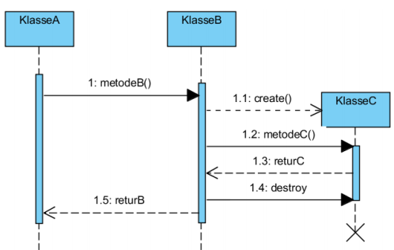
    - loop
        - ramme med betingelse
        - 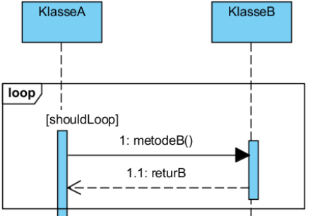
    - if
        - flere typer rammer:
            - opt for if
            - alt for if/else
            - andre som kan si noe om parallellitet
    - if/else
        - 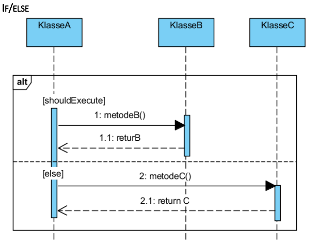